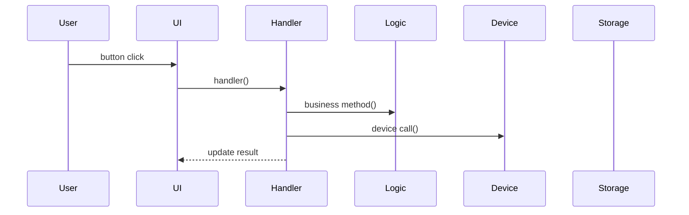

# Event Flow Diagram Style v0.8

Use fixed participants in sequence diagrams:

```mermaid
sequenceDiagram
  participant User
  participant UI
  participant Handler
  participant Logic
  participant Device
  participant Storage
  User->>UI: button click
  UI->>Handler: handler()
  Handler->>Logic: business method()
  Handler->>Device: device call()
  Handler-->>UI: update result
```

Do not create one participant per method call. This prevents diagrams from expanding horizontally and shrinking text.
