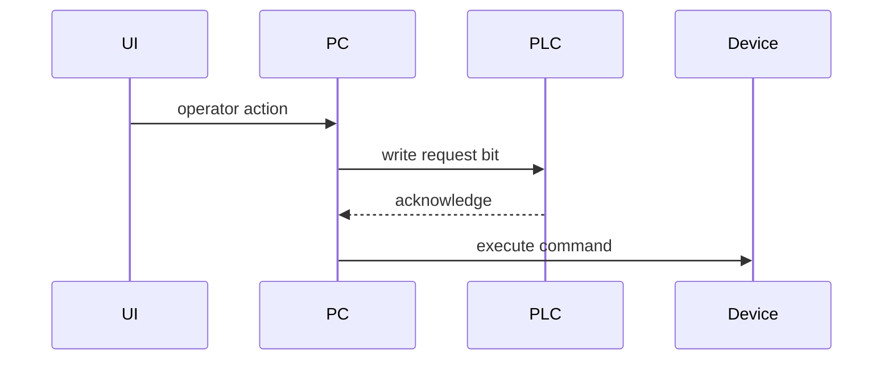

# Industrial VB.NET Manual Standard

Use this structure for each file-level manual.

## 1. Document Overview

Write one short paragraph that defines the file's role in the automation system.

Include:

- file path
- primary responsibility
- machine area or device area if known
- main execution model, such as UI thread, timer, background worker, socket callback, or PLC polling loop

## 2. Core Workflow

Use Mermaid when possible.

Preferred diagrams:

- `flowchart TD` for UI-to-PLC action chains
- `sequenceDiagram` for socket/MES/barcode handshakes
- state tables for `Step_*` or `Select Case` state machines

For each workflow, include:

- trigger
- preconditions
- major steps
- PLC reads/writes
- external calls
- UI updates
- failure path

## 3. PLC Register Mapping

Create a table:

| Address | Type | Direction | Trigger/Owner | Meaning | Evidence |
|---|---|---|---|---|---|
| M200 | bit | read | PLC_Monitor | Start request edge | file:line |
| D100 | word | read | PLCAlarm | Alarm code | file:line |

Use exact address names from source code. If the meaning is inferred, mark it as inferred.

## 4. Threading Model

Create a table:

| Code Area | Thread | Work Done | UI Access | Risk |
|---|---|---|---|---|
| BackgroundWorker_DoWork | Background | PLC polling | Must use Invoke | missed edge / reconnect |
| Timer_Tick | UI | state-machine step | direct UI access | blocking UI |

Call out:

- `Invoke` / `BeginInvoke`
- shared state variables
- queue access
- reconnect loops
- blocking calls such as `Thread.Sleep`
- race-condition candidates

## 5. State Machines & Handshakes

For each state machine:

| State/Case | Entry Condition | Action | Output Signal | Next State | Failure/Timeout |
|---|---|---|---|---|---|

For handshakes, include:

## 6. External Integration & Data Flow

Document:

- MES / SOAP / Web Service calls
- barcode reader triggers
- upload queues
- retry and cache behavior
- INI reads/writes
- source of truth for lot, recipe, tray, carrier, product, and alarm data

Use this table:

| Data Item | Source | Temporary Storage | Persistent Storage | External Destination | Recovery Behavior |
|---|---|---|---|---|---|

## 7. Lifecycle & Safety

Document startup:

- configuration load
- PLC/device connection
- UI initialization
- background worker/timer start
- safety checks

Document shutdown:

- stop timers/workers
- close sockets
- flush queues
- save INI/state
- release hardware resources

## 8. UI Rendering & Permissions

For map-like UI:

- explain the data source
- explain color/status mapping
- explain refresh timing
- identify rendering risks for stale data

For permissions:

| Role/Level | Enabled Controls | Disabled Controls | Evidence |
|---|---|---|---|

## 9. Maintenance Notes

Include:

- hardcoded paths
- hardcoded PLC addresses
- machine-model-specific exceptions
- magic numbers
- hidden timing assumptions
- reconnect behavior
- retry limits
- race conditions
- UI blocking risks
- unclear naming

## 10. Open Questions

List questions a maintainer should confirm with operators, controls engineers, or original developers.

Examples:

- Which PLC address list is authoritative?
- What timeout should stop the equipment safely?
- Which INI values must survive power loss?
- Which MES upload failures require operator intervention?
