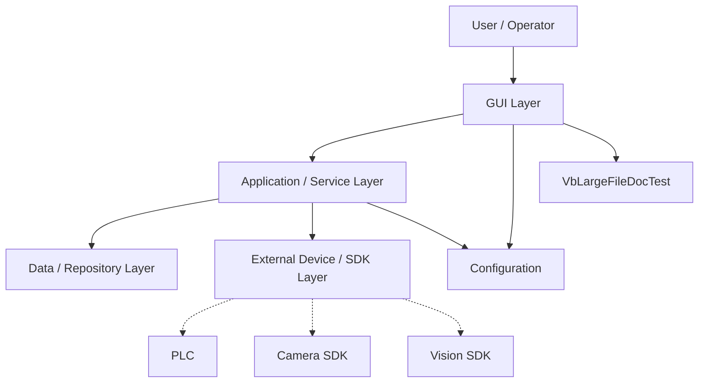
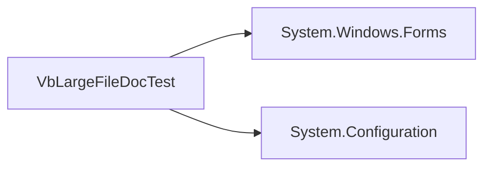

# 02 Architecture

## Overall Block Architecture

## Layer Explanation

| Layer | Responsibility | Review Focus |
|---|---|---|
| GUI Layer | Forms / Windows / UserControls, user events, UI updates | UI-logic coupling, thread safety |
| Application / Service Layer | Workflow orchestration and business logic | God service, testability |
| Data / Repository Layer | Database/file persistence | connection/config/runtime risk |
| External Device / SDK Layer | Camera, PLC, motion, native SDKs | runtime, timeout, x86/x64, license |
| Configuration | App.config, settings, registry, environment | hardcoded and environment-specific behavior |

## Module Responsibility from Project Chunks

| Project | Responsibility | Sources |
|---|---|---|
| VbLargeFileDocTest | [] | ['VbLargeFileDocTest.vbproj'] |

## Architecture Details from Curated Chunks

### [Project: VbLargeFileDocTest](chunks/projects/VbLargeFileDocTest.md)

# Project: VbLargeFileDocTest

## Summary

Project-level chunk for module responsibility and dependencies.

## Project Metadata

| Item | Value |
|---|---|
| Name | VbLargeFileDocTest |
| Language | VB.NET |
| Path | VbLargeFileDocTest.vbproj |
| Target Framework | net48 |
| GUI Project | True |
| Responsibility Inference | [] |

## Local Dependency Graph

## Dependencies

| Type | Target | Source |
|---|---|---|
| Reference | System.Windows.Forms | VbLargeFileDocTest.vbproj |
| Reference | System.Configuration | VbLargeFileDocTest.vbproj |

## Module Responsibility

- 主要責任：需人工確認。推測
- 維護注意：確認此模組是否同時承擔 UI、業務邏輯、設備控制或資料存取，避免耦合過高。

## Risks

| Risk | Evidence | Confidence |
|---|---|---|

