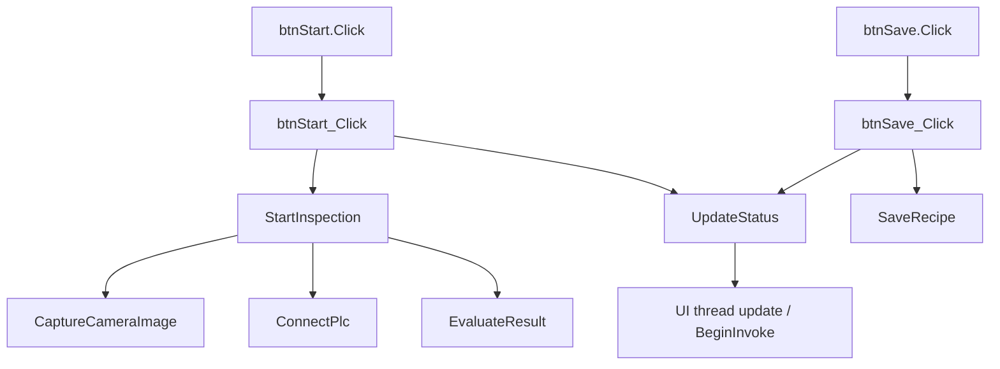

# 05 Method Flow

## Method Flow Overview



## Key Flow Summary

```text
btnStart_Click
  -> StartInspection
      -> CaptureCameraImage
      -> ConnectPlc
      -> EvaluateResult

btnSave_Click
  -> SaveRecipe
  -> UpdateStatus

UpdateStatus
  -> UI thread update / BeginInvoke

```

## How To Read This Document

- Start with the Mermaid overview to understand the main call path.
- Use the method index to jump to a single-method chunk when you need details.
- Use the source-file index to understand which files own which responsibilities.
- Large file tasks are AI review slices; the grouped table below recombines them by method and region for human reading.

## Method Index

| Method | Source | Lines | Calls | Called By | Top Callees |
|---|---|---|---|---|---|
| [btnSave_Click](chunks/methods/Forms_MainForm.vb_btnSave_Click_24.md) | Forms/MainForm.vb | 24-28 | 2 | 0 | SaveRecipe, UpdateStatus |
| [btnStart_Click](chunks/methods/Forms_MainForm.vb_btnStart_Click_19.md) | Forms/MainForm.vb | 19-23 | 2 | 0 | StartInspection, UpdateStatus |
| [CaptureCameraImage](chunks/methods/Forms_MainForm.vb_CaptureCameraImage_1998.md) | Forms/MainForm.vb | 1998-2001 | 0 | 1 | N/A |
| [ConnectPlc](chunks/methods/Forms_MainForm.vb_ConnectPlc_1994.md) | Forms/MainForm.vb | 1994-1997 | 0 | 1 | N/A |
| [EvaluateResult](chunks/methods/Forms_MainForm.vb_EvaluateResult_36.md) | Forms/MainForm.vb | 36-1991 | 0 | 1 | N/A |
| [New](chunks/methods/Forms_MainForm.vb_New_12.md) | Forms/MainForm.vb | 12-18 | 0 | 0 | N/A |
| [SaveRecipe](chunks/methods/Forms_MainForm.vb_SaveRecipe_2003.md) | Forms/MainForm.vb | 2003-2007 | 0 | 1 | N/A |
| [StartInspection](chunks/methods/Forms_MainForm.vb_StartInspection_29.md) | Forms/MainForm.vb | 29-35 | 3 | 1 | CaptureCameraImage, ConnectPlc, EvaluateResult |
| [UpdateStatus](chunks/methods/Forms_MainForm.vb_UpdateStatus_2008.md) | Forms/MainForm.vb | 2008-2015 | 0 | 2 | N/A |
| [BuildForm](chunks/methods/Modules_MainFormAccessModule01.vb_BuildForm_6.md) | Modules/MainFormAccessModule01.vb | 6-8 | 0 | 0 | N/A |
| [ReadFormTitle](chunks/methods/Modules_MainFormAccessModule01.vb_ReadFormTitle_9.md) | Modules/MainFormAccessModule01.vb | 9-12 | 0 | 0 | N/A |
| [BuildForm](chunks/methods/Modules_MainFormAccessModule02.vb_BuildForm_6.md) | Modules/MainFormAccessModule02.vb | 6-8 | 0 | 0 | N/A |
| [ReadFormTitle](chunks/methods/Modules_MainFormAccessModule02.vb_ReadFormTitle_9.md) | Modules/MainFormAccessModule02.vb | 9-12 | 0 | 0 | N/A |
| [BuildForm](chunks/methods/Modules_MainFormAccessModule03.vb_BuildForm_6.md) | Modules/MainFormAccessModule03.vb | 6-8 | 0 | 0 | N/A |
| [ReadFormTitle](chunks/methods/Modules_MainFormAccessModule03.vb_ReadFormTitle_9.md) | Modules/MainFormAccessModule03.vb | 9-12 | 0 | 0 | N/A |
| [BuildForm](chunks/methods/Modules_MainFormAccessModule04.vb_BuildForm_6.md) | Modules/MainFormAccessModule04.vb | 6-8 | 0 | 0 | N/A |
| [ReadFormTitle](chunks/methods/Modules_MainFormAccessModule04.vb_ReadFormTitle_9.md) | Modules/MainFormAccessModule04.vb | 9-12 | 0 | 0 | N/A |
| [BuildForm](chunks/methods/Modules_MainFormAccessModule05.vb_BuildForm_6.md) | Modules/MainFormAccessModule05.vb | 6-8 | 0 | 0 | N/A |
| [ReadFormTitle](chunks/methods/Modules_MainFormAccessModule05.vb_ReadFormTitle_9.md) | Modules/MainFormAccessModule05.vb | 9-12 | 0 | 0 | N/A |
| [BuildForm](chunks/methods/Modules_MainFormAccessModule06.vb_BuildForm_6.md) | Modules/MainFormAccessModule06.vb | 6-8 | 0 | 0 | N/A |
| [ReadFormTitle](chunks/methods/Modules_MainFormAccessModule06.vb_ReadFormTitle_9.md) | Modules/MainFormAccessModule06.vb | 9-12 | 0 | 0 | N/A |
| [BuildForm](chunks/methods/Modules_MainFormAccessModule07.vb_BuildForm_6.md) | Modules/MainFormAccessModule07.vb | 6-8 | 0 | 0 | N/A |
| [ReadFormTitle](chunks/methods/Modules_MainFormAccessModule07.vb_ReadFormTitle_9.md) | Modules/MainFormAccessModule07.vb | 9-12 | 0 | 0 | N/A |
| [BuildForm](chunks/methods/Modules_MainFormAccessModule08.vb_BuildForm_6.md) | Modules/MainFormAccessModule08.vb | 6-8 | 0 | 0 | N/A |
| [ReadFormTitle](chunks/methods/Modules_MainFormAccessModule08.vb_ReadFormTitle_9.md) | Modules/MainFormAccessModule08.vb | 9-12 | 0 | 0 | N/A |
| [BuildForm](chunks/methods/Modules_MainFormAccessModule09.vb_BuildForm_6.md) | Modules/MainFormAccessModule09.vb | 6-8 | 0 | 0 | N/A |
| [ReadFormTitle](chunks/methods/Modules_MainFormAccessModule09.vb_ReadFormTitle_9.md) | Modules/MainFormAccessModule09.vb | 9-12 | 0 | 0 | N/A |
| [BuildForm](chunks/methods/Modules_MainFormAccessModule10.vb_BuildForm_6.md) | Modules/MainFormAccessModule10.vb | 6-8 | 0 | 0 | N/A |
| [ReadFormTitle](chunks/methods/Modules_MainFormAccessModule10.vb_ReadFormTitle_9.md) | Modules/MainFormAccessModule10.vb | 9-12 | 0 | 0 | N/A |
| [BuildForm](chunks/methods/Modules_MainFormAccessModule11.vb_BuildForm_6.md) | Modules/MainFormAccessModule11.vb | 6-8 | 0 | 0 | N/A |
| [ReadFormTitle](chunks/methods/Modules_MainFormAccessModule11.vb_ReadFormTitle_9.md) | Modules/MainFormAccessModule11.vb | 9-12 | 0 | 0 | N/A |
| [BuildForm](chunks/methods/Modules_MainFormAccessModule12.vb_BuildForm_6.md) | Modules/MainFormAccessModule12.vb | 6-8 | 0 | 0 | N/A |
| [ReadFormTitle](chunks/methods/Modules_MainFormAccessModule12.vb_ReadFormTitle_9.md) | Modules/MainFormAccessModule12.vb | 9-12 | 0 | 0 | N/A |
| [BuildForm](chunks/methods/Modules_MainFormAccessModule13.vb_BuildForm_6.md) | Modules/MainFormAccessModule13.vb | 6-8 | 0 | 0 | N/A |
| [ReadFormTitle](chunks/methods/Modules_MainFormAccessModule13.vb_ReadFormTitle_9.md) | Modules/MainFormAccessModule13.vb | 9-12 | 0 | 0 | N/A |
| [BuildForm](chunks/methods/Modules_MainFormAccessModule14.vb_BuildForm_6.md) | Modules/MainFormAccessModule14.vb | 6-8 | 0 | 0 | N/A |
| [ReadFormTitle](chunks/methods/Modules_MainFormAccessModule14.vb_ReadFormTitle_9.md) | Modules/MainFormAccessModule14.vb | 9-12 | 0 | 0 | N/A |
| [BuildForm](chunks/methods/Modules_MainFormAccessModule15.vb_BuildForm_6.md) | Modules/MainFormAccessModule15.vb | 6-8 | 0 | 0 | N/A |
| [ReadFormTitle](chunks/methods/Modules_MainFormAccessModule15.vb_ReadFormTitle_9.md) | Modules/MainFormAccessModule15.vb | 9-12 | 0 | 0 | N/A |
| [BuildForm](chunks/methods/Modules_MainFormAccessModule16.vb_BuildForm_6.md) | Modules/MainFormAccessModule16.vb | 6-8 | 0 | 0 | N/A |
| [ReadFormTitle](chunks/methods/Modules_MainFormAccessModule16.vb_ReadFormTitle_9.md) | Modules/MainFormAccessModule16.vb | 9-12 | 0 | 0 | N/A |
| [BuildForm](chunks/methods/Modules_MainFormAccessModule17.vb_BuildForm_6.md) | Modules/MainFormAccessModule17.vb | 6-8 | 0 | 0 | N/A |
| [ReadFormTitle](chunks/methods/Modules_MainFormAccessModule17.vb_ReadFormTitle_9.md) | Modules/MainFormAccessModule17.vb | 9-12 | 0 | 0 | N/A |
| [BuildForm](chunks/methods/Modules_MainFormAccessModule18.vb_BuildForm_6.md) | Modules/MainFormAccessModule18.vb | 6-8 | 0 | 0 | N/A |
| [ReadFormTitle](chunks/methods/Modules_MainFormAccessModule18.vb_ReadFormTitle_9.md) | Modules/MainFormAccessModule18.vb | 9-12 | 0 | 0 | N/A |
| [BuildForm](chunks/methods/Modules_MainFormAccessModule19.vb_BuildForm_6.md) | Modules/MainFormAccessModule19.vb | 6-8 | 0 | 0 | N/A |
| [ReadFormTitle](chunks/methods/Modules_MainFormAccessModule19.vb_ReadFormTitle_9.md) | Modules/MainFormAccessModule19.vb | 9-12 | 0 | 0 | N/A |
| [BuildForm](chunks/methods/Modules_MainFormAccessModule20.vb_BuildForm_6.md) | Modules/MainFormAccessModule20.vb | 6-8 | 0 | 0 | N/A |
| [ReadFormTitle](chunks/methods/Modules_MainFormAccessModule20.vb_ReadFormTitle_9.md) | Modules/MainFormAccessModule20.vb | 9-12 | 0 | 0 | N/A |

## Source File Index

| Source File | Lines | Methods | Classes / Modules |
|---|---|---|---|
| [Forms/MainForm.vb](chunks/source_files/Forms_MainForm.vb.md) | 2017 | 9 | 1 |
| [Modules/MainFormAccessModule01.vb](chunks/source_files/Modules_MainFormAccessModule01.vb.md) | 14 | 2 | 1 |
| [Modules/MainFormAccessModule02.vb](chunks/source_files/Modules_MainFormAccessModule02.vb.md) | 14 | 2 | 1 |
| [Modules/MainFormAccessModule03.vb](chunks/source_files/Modules_MainFormAccessModule03.vb.md) | 14 | 2 | 1 |
| [Modules/MainFormAccessModule04.vb](chunks/source_files/Modules_MainFormAccessModule04.vb.md) | 14 | 2 | 1 |
| [Modules/MainFormAccessModule05.vb](chunks/source_files/Modules_MainFormAccessModule05.vb.md) | 14 | 2 | 1 |
| [Modules/MainFormAccessModule06.vb](chunks/source_files/Modules_MainFormAccessModule06.vb.md) | 14 | 2 | 1 |
| [Modules/MainFormAccessModule07.vb](chunks/source_files/Modules_MainFormAccessModule07.vb.md) | 14 | 2 | 1 |
| [Modules/MainFormAccessModule08.vb](chunks/source_files/Modules_MainFormAccessModule08.vb.md) | 14 | 2 | 1 |
| [Modules/MainFormAccessModule09.vb](chunks/source_files/Modules_MainFormAccessModule09.vb.md) | 14 | 2 | 1 |
| [Modules/MainFormAccessModule10.vb](chunks/source_files/Modules_MainFormAccessModule10.vb.md) | 14 | 2 | 1 |
| [Modules/MainFormAccessModule11.vb](chunks/source_files/Modules_MainFormAccessModule11.vb.md) | 14 | 2 | 1 |
| [Modules/MainFormAccessModule12.vb](chunks/source_files/Modules_MainFormAccessModule12.vb.md) | 14 | 2 | 1 |
| [Modules/MainFormAccessModule13.vb](chunks/source_files/Modules_MainFormAccessModule13.vb.md) | 14 | 2 | 1 |
| [Modules/MainFormAccessModule14.vb](chunks/source_files/Modules_MainFormAccessModule14.vb.md) | 14 | 2 | 1 |
| [Modules/MainFormAccessModule15.vb](chunks/source_files/Modules_MainFormAccessModule15.vb.md) | 14 | 2 | 1 |
| [Modules/MainFormAccessModule16.vb](chunks/source_files/Modules_MainFormAccessModule16.vb.md) | 14 | 2 | 1 |
| [Modules/MainFormAccessModule17.vb](chunks/source_files/Modules_MainFormAccessModule17.vb.md) | 14 | 2 | 1 |
| [Modules/MainFormAccessModule18.vb](chunks/source_files/Modules_MainFormAccessModule18.vb.md) | 14 | 2 | 1 |
| [Modules/MainFormAccessModule19.vb](chunks/source_files/Modules_MainFormAccessModule19.vb.md) | 14 | 2 | 1 |
| [Modules/MainFormAccessModule20.vb](chunks/source_files/Modules_MainFormAccessModule20.vb.md) | 14 | 2 | 1 |

## Large File Method / Region Index

| Source | Region | Method / Segment | Structural Blocks | Line Ranges | Task Links |
|---|---|---|---|---|---|
| Forms/MainForm.vb | No #Region | (file gap) | N/A | 1-5, 6-11, 1992-1992, 2016-2016, 2017-2017 | [1](chunks/large_file_tasks/Forms_MainForm.vb_lines_1_5.md), [6](chunks/large_file_tasks/Forms_MainForm.vb_lines_6_11.md), [1992](chunks/large_file_tasks/Forms_MainForm.vb_lines_1992_1992.md), [2016](chunks/large_file_tasks/Forms_MainForm.vb_lines_2016_2016.md), [2017](chunks/large_file_tasks/Forms_MainForm.vb_lines_2017_2017.md) |
| Forms/MainForm.vb | No #Region | EvaluateResult | N/A | 902-1701, 1702-1991 | [902](chunks/large_file_tasks/Forms_MainForm.vb_lines_902_1701.md), [1702](chunks/large_file_tasks/Forms_MainForm.vb_lines_1702_1991.md) |
| Forms/MainForm.vb | No #Region | EvaluateResult | Switch/Case: mode | 36-832, 847-882, 893-893 | [36](chunks/large_file_tasks/Forms_MainForm.vb_lines_36_832.md), [847](chunks/large_file_tasks/Forms_MainForm.vb_lines_847_882.md), [893](chunks/large_file_tasks/Forms_MainForm.vb_lines_893_893.md) |
| Forms/MainForm.vb | No #Region | New | N/A | 12-18 | [12](chunks/large_file_tasks/Forms_MainForm.vb_lines_12_18.md) |
| Forms/MainForm.vb | No #Region | SaveRecipe | N/A | 2003-2007 | [2003](chunks/large_file_tasks/Forms_MainForm.vb_lines_2003_2007.md) |
| Forms/MainForm.vb | No #Region | StartInspection | N/A | 29-35 | [29](chunks/large_file_tasks/Forms_MainForm.vb_lines_29_35.md) |
| Forms/MainForm.vb | No #Region | UpdateStatus | N/A | 2008-2015 | [2008](chunks/large_file_tasks/Forms_MainForm.vb_lines_2008_2015.md) |
| Forms/MainForm.vb | No #Region | btnSave_Click | N/A | 24-28 | [24](chunks/large_file_tasks/Forms_MainForm.vb_lines_24_28.md) |
| Forms/MainForm.vb | No #Region | btnStart_Click | N/A | 19-23 | [19](chunks/large_file_tasks/Forms_MainForm.vb_lines_19_23.md) |
| Forms/MainForm.vb | PLC and Camera Simulation | ConnectPlc | N/A | 1993-2002 | [1993](chunks/large_file_tasks/Forms_MainForm.vb_lines_1993_2002.md) |
| Forms/MainForm.vb | inspection branch filler 0 | EvaluateResult | N/A | 833-846 | [833](chunks/large_file_tasks/Forms_MainForm.vb_lines_833_846.md) |
| Forms/MainForm.vb | inspection branch filler 1 | EvaluateResult | N/A | 883-892 | [883](chunks/large_file_tasks/Forms_MainForm.vb_lines_883_892.md) |
| Forms/MainForm.vb | inspection branch filler 2 | EvaluateResult | N/A | 894-901 | [894](chunks/large_file_tasks/Forms_MainForm.vb_lines_894_901.md) |

## Method Details

Detailed per-method notes live in `docs/chunks/methods/`. Use the links in the method index above.

## Large File Task Details

Detailed large-file review slices live in `docs/chunks/large_file_tasks/`. Use the grouped links above when reviewing long methods.
