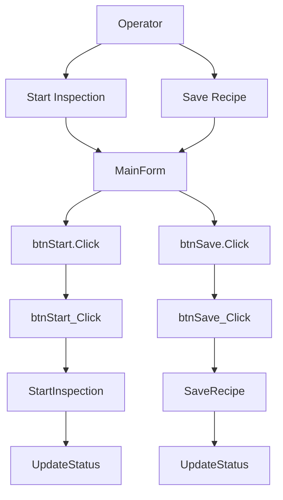

# 07 User Workflow

## Workflow Overview

## How To Read This Document

- Read this as an operator or handover scenario guide: what the user does, what should happen, and which code path supports it.
- Use `04_event_flow.md` when you need the lower-level event-to-handler sequence details.
- Use the links below to jump from a user workflow to the related event-flow and method chunks.

## Workflow Summary

| Workflow | User Action / Event | Handler | Expected Result | Key Technical Path | Detail |
|---|---|---|---|---|---|
| Start Inspection | btnStart.Click | btnStart_Click | Run inspection logic, interact with device/camera simulation, evaluate result, then refresh status. | [btnStart_Click](chunks/methods/Forms_MainForm.vb_btnStart_Click_19.md) -> [StartInspection](chunks/methods/Forms_MainForm.vb_StartInspection_29.md) -> [UpdateStatus](chunks/methods/Forms_MainForm.vb_UpdateStatus_2008.md) | [event flow](chunks/event_flows/0000_btnStart.Click_btnStart_Click.md) |
| Save Recipe | btnSave.Click | btnSave_Click | Save recipe/configuration data and refresh status. | [btnSave_Click](chunks/methods/Forms_MainForm.vb_btnSave_Click_24.md) -> [SaveRecipe](chunks/methods/Forms_MainForm.vb_SaveRecipe_2003.md) -> [UpdateStatus](chunks/methods/Forms_MainForm.vb_UpdateStatus_2008.md) | [event flow](chunks/event_flows/0001_btnSave.Click_btnSave_Click.md) |

## Scenario Details

### Start Inspection

| Field | Value |
|---|---|
| Entry Event | btnStart.Click |
| Handler | btnStart_Click |
| Source | Forms/MainForm.vb |
| Expected Result | Run inspection logic, interact with device/camera simulation, evaluate result, then refresh status. |
| Related Event Flow | [0000_btnStart.Click_btnStart_Click](chunks/event_flows/0000_btnStart.Click_btnStart_Click.md) |
| Related Methods | [btnStart_Click](chunks/methods/Forms_MainForm.vb_btnStart_Click_19.md), [StartInspection](chunks/methods/Forms_MainForm.vb_StartInspection_29.md), [UpdateStatus](chunks/methods/Forms_MainForm.vb_UpdateStatus_2008.md) |

#### Scenario Steps

| Step | Role | Action |
|---|---|---|
| 1 | Operator action | Trigger `btnStart.Click` on the UI. |
| 2 | Event dispatch | WinForms routes the event to `btnStart_Click`. |
| 3 | Application logic | Call `StartInspection`. |
| 4 | Application logic | Call `UpdateStatus`. |

#### Review Checklist

- Confirm the UI event is wired to the expected handler.
- Confirm validation, device/config access, and status updates are intentional.
- Confirm failures are visible to the operator and do not leave the UI in an inconsistent state.

### Save Recipe

| Field | Value |
|---|---|
| Entry Event | btnSave.Click |
| Handler | btnSave_Click |
| Source | Forms/MainForm.vb |
| Expected Result | Save recipe/configuration data and refresh status. |
| Related Event Flow | [0001_btnSave.Click_btnSave_Click](chunks/event_flows/0001_btnSave.Click_btnSave_Click.md) |
| Related Methods | [btnSave_Click](chunks/methods/Forms_MainForm.vb_btnSave_Click_24.md), [SaveRecipe](chunks/methods/Forms_MainForm.vb_SaveRecipe_2003.md), [UpdateStatus](chunks/methods/Forms_MainForm.vb_UpdateStatus_2008.md) |

#### Scenario Steps

| Step | Role | Action |
|---|---|---|
| 1 | Operator action | Trigger `btnSave.Click` on the UI. |
| 2 | Event dispatch | WinForms routes the event to `btnSave_Click`. |
| 3 | Application logic | Call `SaveRecipe`. |
| 4 | Application logic | Call `UpdateStatus`. |

#### Review Checklist

- Confirm the UI event is wired to the expected handler.
- Confirm validation, device/config access, and status updates are intentional.
- Confirm failures are visible to the operator and do not leave the UI in an inconsistent state.

## UI Entry Points

| Form | Chunk | Source Refs |
|---|---|---|
| Form: MainForm | [MainForm](chunks/forms/MainForm.md) | ['Forms/MainForm.vb'] |
