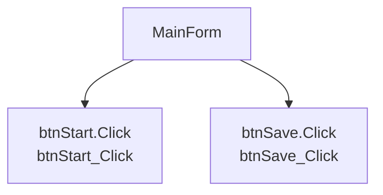
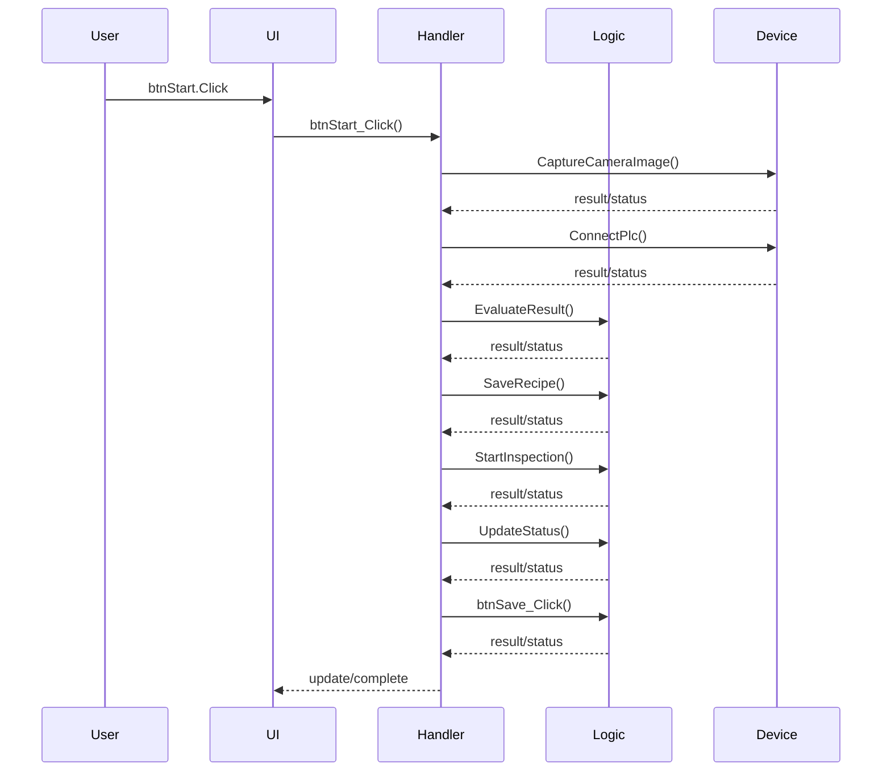
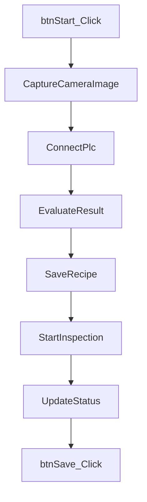
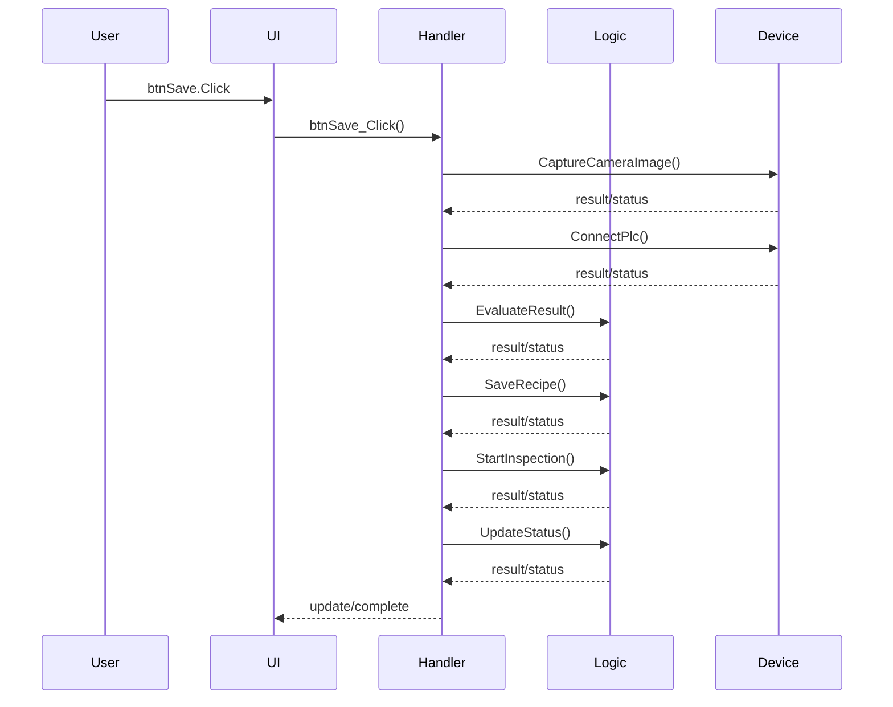
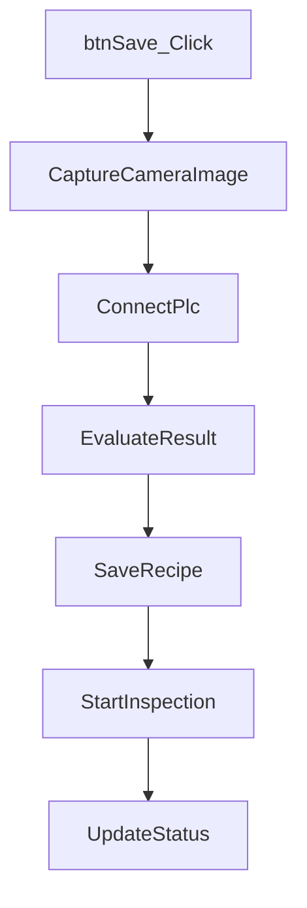

# 07 User Workflow

## Workflow Candidates from Event/Form Chunks

This document is assembled from form and event-flow chunks. Regenerate individual form or event-flow chunks to improve workflow quality.

## Form Chunks

| Chunk ID | Title | Source Refs |
|---|---|---|
| MainForm | Form: MainForm | ['Forms/MainForm.vb'] |

## Event Flow Chunks

| Chunk ID | Title | Source Refs |
|---|---|---|
| 0000_btnStart.Click_btnStart_Click | Event Flow: btnStart.Click -> btnStart_Click | ['Forms/MainForm.vb'] |
| 0001_btnSave.Click_btnSave_Click | Event Flow: btnSave.Click -> btnSave_Click | ['Forms/MainForm.vb'] |

## Curated Form/Event Chunk Details

### [Form: MainForm](chunks/forms/MainForm.md)

# Form: MainForm

## Responsibility Summary

- 畫面用途：根據事件與方法推測，此 Form 可能負責使用者操作入口、狀態顯示或特定功能流程。推測
- 需人工確認：畫面實際責任、導航來源、是否包含設備控制或資料存取。

## UI Event Entries

| Control | Event | Handler | Source | Line |
|---|---|---|---|---|
| btnStart | Click | btnStart_Click | Forms/MainForm.vb | 16 |
| btnSave | Click | btnSave_Click | Forms/MainForm.vb | 17 |

## Form Event Flow Graph

## Handler Methods

| Method | Calls | Side Effects | Source |
|---|---|---|---|
| btnSave_Click | ['CaptureCameraImage', 'ConnectPlc', 'EvaluateResult', 'SaveRecipe', 'StartInspection', 'UpdateStatus'] | ['Persistence or write operation candidate 推測', 'External device/API interaction candidate 推測'] | Forms/MainForm.vb |
| btnStart_Click | ['CaptureCameraImage', 'ConnectPlc', 'EvaluateResult', 'SaveRecipe', 'StartInspection', 'UpdateStatus', 'btnSave_Click'] | ['Persistence or write operation candidate 推測', 'External device/API interaction candidate 推測'] | Forms/MainForm.vb |

## Maintenance Notes

- 檢查此 Form 是否過度集中業務邏輯。
- 檢查事件 handler 是否直接操作設備、DB 或設定檔。
- 檢查長時間操作是否會阻塞 UI thread。

## Risks

| Risk | Evidence | Confidence |
|---|---|---|
| cross-thread UI risk | invoke | 0.55 |
| cross-thread UI risk | begininvoke | 0.55 |
| event leak risk | addhandler | 0.55 |
| blocking UI risk | thread.sleep | 0.55 |

### [Event Flow: btnStart.Click -> btnStart_Click](chunks/event_flows/0000_btnStart.Click_btnStart_Click.md)

# Event Flow: btnStart.Click -> btnStart_Click

## Event Entry

| Item | Value |
|---|---|
| Entry | btnStart.Click |
| Handler | btnStart_Click |
| Source | Forms/MainForm.vb |
| Line | 16 |
| Confidence | 0.75 |

## Simplified Sequence Diagram

## Call Chain

## Handler Method Details

| Method | Calls | Side Effects | Source |
|---|---|---|---|
| btnStart_Click | ['CaptureCameraImage', 'ConnectPlc', 'EvaluateResult', 'SaveRecipe', 'StartInspection', 'UpdateStatus', 'btnSave_Click'] | ['Persistence or write operation candidate 推測', 'External device/API interaction candidate 推測'] | Forms/MainForm.vb |

## Method Purpose Analysis

### btnStart_Click

**用途：**
處理 GUI 或系統事件；執行 Start 類型流程。推測

**推測依據：**
- 由事件或事件流程觸發: btnStart.Click, btnStart.Click
- 方法名稱包含事件處理常見關鍵字
- 名稱或呼叫鏈包含 Start 相關關鍵字: start
- 呼叫方法: CaptureCameraImage, ConnectPlc, EvaluateResult, SaveRecipe, StartInspection, UpdateStatus, btnSave_Click

**副作用：**
- 可能存取外部設備 / SDK: plc, camera, capture
- 可能存取 DB 或資料儲存: update
- 可能更新 UI 狀態或顯示內容: ui, form, update
- 可能建立新物件或初始化流程: new
- Persistence or write operation candidate 推測
- External device/API interaction candidate 推測

**維護注意事項：**
- 檢查設備呼叫是否有 timeout、重試、例外處理與安全狀態
- 檢查資料庫連線、交易、例外處理與設定來源
- 若此方法可能在背景執行，需檢查 UI thread Invoke / Dispatcher
- 檢查物件生命週期、Dispose、資源釋放與重複初始化風險

## Review Notes

- 確認事件是否可能被重複觸發。
- 確認 handler 是否包含長時間阻塞操作。
- 確認設備或資料存取是否有例外處理。

### [Event Flow: btnSave.Click -> btnSave_Click](chunks/event_flows/0001_btnSave.Click_btnSave_Click.md)

# Event Flow: btnSave.Click -> btnSave_Click

## Event Entry

| Item | Value |
|---|---|
| Entry | btnSave.Click |
| Handler | btnSave_Click |
| Source | Forms/MainForm.vb |
| Line | 17 |
| Confidence | 0.75 |

## Simplified Sequence Diagram

## Call Chain

## Handler Method Details

| Method | Calls | Side Effects | Source |
|---|---|---|---|
| btnSave_Click | ['CaptureCameraImage', 'ConnectPlc', 'EvaluateResult', 'SaveRecipe', 'StartInspection', 'UpdateStatus'] | ['Persistence or write operation candidate 推測', 'External device/API interaction candidate 推測'] | Forms/MainForm.vb |

## Method Purpose Analysis

### btnSave_Click

**用途：**
處理 GUI 或系統事件；執行 Start 類型流程。推測

**推測依據：**
- 由事件或事件流程觸發: btnSave.Click, btnSave.Click
- 方法名稱包含事件處理常見關鍵字
- 名稱或呼叫鏈包含 Start 相關關鍵字: start
- 呼叫方法: CaptureCameraImage, ConnectPlc, EvaluateResult, SaveRecipe, StartInspection, UpdateStatus

**副作用：**
- 可能存取外部設備 / SDK: plc, camera, capture
- 可能存取 DB 或資料儲存: update
- 可能更新 UI 狀態或顯示內容: ui, form, update
- 可能建立新物件或初始化流程: new
- Persistence or write operation candidate 推測
- External device/API interaction candidate 推測

**維護注意事項：**
- 檢查設備呼叫是否有 timeout、重試、例外處理與安全狀態
- 檢查資料庫連線、交易、例外處理與設定來源
- 若此方法可能在背景執行，需檢查 UI thread Invoke / Dispatcher
- 檢查物件生命週期、Dispose、資源釋放與重複初始化風險

## Review Notes

- 確認事件是否可能被重複觸發。
- 確認 handler 是否包含長時間阻塞操作。
- 確認設備或資料存取是否有例外處理。

