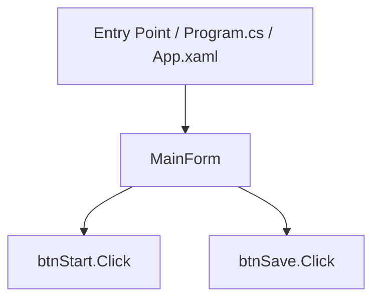

# VbLargeFileDocTest

## 概述

此專案為 .NET GUI 應用程式。根據目前靜態分析結果，系統包含 GUI 畫面、事件流程、方法呼叫鏈、設定檔與外部相依項目。

本 README 是企業級交接入口，供新進工程師、維護工程師與 AI Agent 快速理解專案。若內容標示為「推測」或「需人工確認」，代表該結論來自靜態分析或命名推測，尚未經人工驗證。

## 技術棧

### 語言/架構

| 項目 |
|---|
| GUI Project |
| VB.NET |
| net48 |


### 硬體通訊

| 類型 | 用途 |
|---|---|
| PLC | 通訊方式需人工確認 |
| Camera SDK | 相機控制 / 取像 推測 |


### 網路通訊

| 類型 | 用途 |
|---|---|
| 需人工確認 | 未偵測到明確網路通訊 |


### 資料儲存

| 類型 | 用途 |
|---|---|
| 需人工確認 | 未偵測到明確資料儲存 |


## 專案結構

```text
project-root/
├── docs/                 # 企業級交接文件
├── openspec/             # AI Agent 可理解規格
├── exports/
│   ├── enterprise_analysis/ # 全專案分析資料
│   └── analysis_chunks/     # 分割分析 chunks
├── VbLargeFileDocTest.vbproj  # VB.NET
```

## 應用程式流程

程式進入點需從 `Program.cs`、`App.xaml` 或專案啟動設定確認。以下流程圖根據表單與事件 chunks 推測產生。



## 表單清單

| 表單名稱 | 用途 | 主要控制項 | 從哪裡開啟此表單 |
|---|---|---|---|
| MainForm | GUI 畫面 / 操作入口 推測 | btnStart, btnSave | btnStart_Click, btnSave_Click |


> [!NOTE]
> **MainForm 事件處理摘要（UI Deep Dive）**
> - **btnStart.Click**：呼叫 `btnStart_Click`，用途需依事件流程確認。推測
> - **btnSave.Click**：呼叫 `btnSave_Click`，用途需依事件流程確認。推測


## 類別與模組清單

以下列出非 Form 相關程式碼的初步職責推測。詳細內容請參考 `docs/05_method_flow.md` 與 `docs/chunks/methods/`。

| 文件 | 類別/模組 | 角色推測 | 方法數 | 呼叫方法數 | 說明 |
|---|---|---|---|---|---|
| Forms/MainForm.vb | MainForm | Form / UI | 9 | 6 | See docs/05_method_flow.md and docs/chunks/methods/ for method details. |
| Modules/MainFormAccessModule01.vb | MainFormAccessModule01 | Form / UI | 2 | 0 | See docs/05_method_flow.md and docs/chunks/methods/ for method details. |
| Modules/MainFormAccessModule02.vb | MainFormAccessModule02 | Form / UI | 2 | 0 | See docs/05_method_flow.md and docs/chunks/methods/ for method details. |
| Modules/MainFormAccessModule03.vb | MainFormAccessModule03 | Form / UI | 2 | 0 | See docs/05_method_flow.md and docs/chunks/methods/ for method details. |
| Modules/MainFormAccessModule04.vb | MainFormAccessModule04 | Form / UI | 2 | 0 | See docs/05_method_flow.md and docs/chunks/methods/ for method details. |
| Modules/MainFormAccessModule05.vb | MainFormAccessModule05 | Form / UI | 2 | 0 | See docs/05_method_flow.md and docs/chunks/methods/ for method details. |
| Modules/MainFormAccessModule06.vb | MainFormAccessModule06 | Form / UI | 2 | 0 | See docs/05_method_flow.md and docs/chunks/methods/ for method details. |
| Modules/MainFormAccessModule07.vb | MainFormAccessModule07 | Form / UI | 2 | 0 | See docs/05_method_flow.md and docs/chunks/methods/ for method details. |
| Modules/MainFormAccessModule08.vb | MainFormAccessModule08 | Form / UI | 2 | 0 | See docs/05_method_flow.md and docs/chunks/methods/ for method details. |
| Modules/MainFormAccessModule09.vb | MainFormAccessModule09 | Form / UI | 2 | 0 | See docs/05_method_flow.md and docs/chunks/methods/ for method details. |
| Modules/MainFormAccessModule10.vb | MainFormAccessModule10 | Form / UI | 2 | 0 | See docs/05_method_flow.md and docs/chunks/methods/ for method details. |
| Modules/MainFormAccessModule11.vb | MainFormAccessModule11 | Form / UI | 2 | 0 | See docs/05_method_flow.md and docs/chunks/methods/ for method details. |
| Modules/MainFormAccessModule12.vb | MainFormAccessModule12 | Form / UI | 2 | 0 | See docs/05_method_flow.md and docs/chunks/methods/ for method details. |
| Modules/MainFormAccessModule13.vb | MainFormAccessModule13 | Form / UI | 2 | 0 | See docs/05_method_flow.md and docs/chunks/methods/ for method details. |
| Modules/MainFormAccessModule14.vb | MainFormAccessModule14 | Form / UI | 2 | 0 | See docs/05_method_flow.md and docs/chunks/methods/ for method details. |
| Modules/MainFormAccessModule15.vb | MainFormAccessModule15 | Form / UI | 2 | 0 | See docs/05_method_flow.md and docs/chunks/methods/ for method details. |
| Modules/MainFormAccessModule16.vb | MainFormAccessModule16 | Form / UI | 2 | 0 | See docs/05_method_flow.md and docs/chunks/methods/ for method details. |
| Modules/MainFormAccessModule17.vb | MainFormAccessModule17 | Form / UI | 2 | 0 | See docs/05_method_flow.md and docs/chunks/methods/ for method details. |
| Modules/MainFormAccessModule18.vb | MainFormAccessModule18 | Form / UI | 2 | 0 | See docs/05_method_flow.md and docs/chunks/methods/ for method details. |
| Modules/MainFormAccessModule19.vb | MainFormAccessModule19 | Form / UI | 2 | 0 | See docs/05_method_flow.md and docs/chunks/methods/ for method details. |
| Modules/MainFormAccessModule20.vb | MainFormAccessModule20 | Form / UI | 2 | 0 | See docs/05_method_flow.md and docs/chunks/methods/ for method details. |


## 參數設定指南

| 檔案位置 | 預設值 | 修改方式（UI修改還是外部修改） |
|---|---|---|
| App.config | 需人工確認 | 外部修改 推測 |
| Forms/MainForm.vb | 需人工確認 | 外部修改 推測 |
| Forms/MainForm.vb | 需人工確認 | 外部修改 推測 |


## 常見操作

### 1. 建置執行

- 使用 Visual Studio 或對應 .NET SDK 開啟 solution / project。
- 確認 NuGet、SDK、Native DLL、COM 元件與 x86/x64 平台設定。
- 若有設備連線，需先確認 PLC / Camera / Motion / DB 設定。

### 2. 查閱 Log

- 搜尋專案中的 `Log`、`logger`、`NLog`、`log4net`、`Serilog`、`WriteLine`。
- 若 Log 路徑來自設定檔，請參考 `docs/06_configuration.md`。
- 若 Log 路徑為硬編碼，請列入 `docs/09_risk_analysis.md`。

### 3. 權限切換

- 若系統存取 Registry、Program Files、設備 SDK、COM 或網路磁碟，需確認執行權限。
- 若使用 Windows 服務或系統管理員權限，需確認部署帳號與 UAC 設定。
- 實際權限流程需人工確認。

### 4. SDK 初始化

- 檢查 Camera / PLC / Motion / Vision SDK 初始化流程。
- 確認 runtime、license、driver、x86/x64 相容性。
- 相關風險請參考 `docs/08_external_dependencies.md`。

### 5. 設定修改

- App.config / settings.json / ini / xml 通常屬於外部修改。
- Settings.settings 可能由 UI 或 Visual Studio Settings 修改。
- 若設定由程式寫入，請確認寫入位置與權限。

## 已知注意事項

| 問題 | 位置 | 證據 | 信心度 |
|---|---|---|---|
| cross-thread UI risk | Forms/MainForm.vb | invoke | 0.55 |
| cross-thread UI risk | Forms/MainForm.vb | begininvoke | 0.55 |
| event leak risk | Forms/MainForm.vb | addhandler | 0.55 |
| blocking UI risk | Forms/MainForm.vb | thread.sleep | 0.55 |


## 相關文件

- `docs/01_solution_structure.md`
- `docs/02_architecture.md`
- `docs/03_project_dependencies.md`
- `docs/04_event_flow.md`
- `docs/05_method_flow.md`
- `docs/06_configuration.md`
- `docs/07_user_workflow.md`
- `docs/08_external_dependencies.md`
- `docs/09_risk_analysis.md`
- `openspec/project.md`
