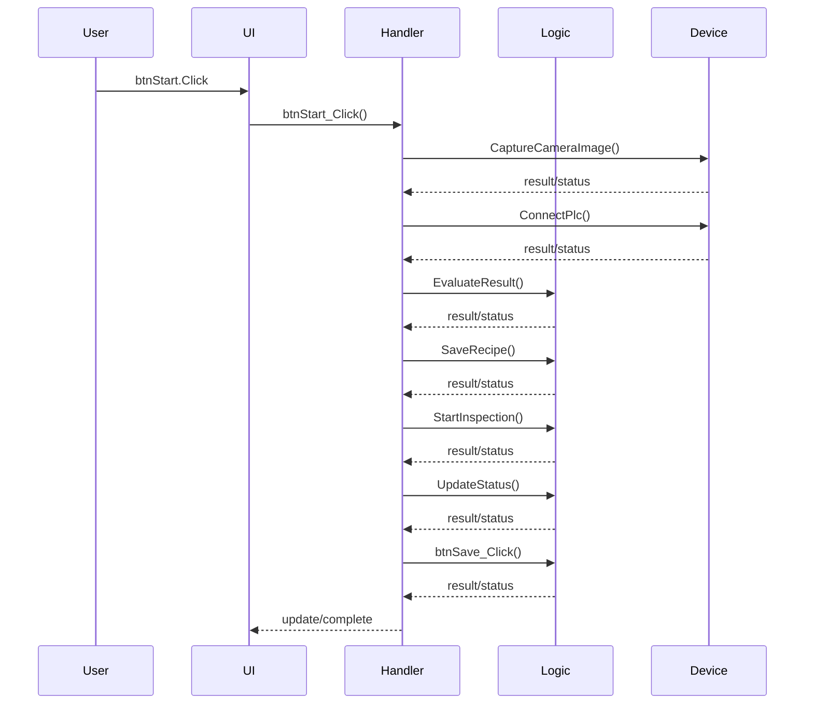
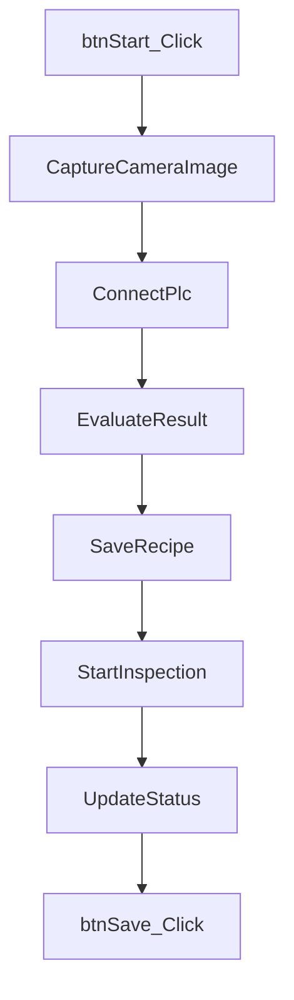

# Event Flow: btnStart.Click -> btnStart_Click

## Event Entry

| Item | Value |
|---|---|
| Entry | btnStart.Click |
| Handler | btnStart_Click |
| Source | Forms/MainForm.vb |
| Line | 16 |
| Confidence | 0.75 |

## Simplified Sequence Diagram

## Call Chain

## Handler Method Details

| Method | Calls | Side Effects | Source |
|---|---|---|---|
| btnStart_Click | ['CaptureCameraImage', 'ConnectPlc', 'EvaluateResult', 'SaveRecipe', 'StartInspection', 'UpdateStatus', 'btnSave_Click'] | ['Persistence or write operation candidate 推測', 'External device/API interaction candidate 推測'] | Forms/MainForm.vb |

## Method Purpose Analysis

### btnStart_Click

**用途：**
處理 GUI 或系統事件；執行 Start 類型流程。推測

**推測依據：**
- 由事件或事件流程觸發: btnStart.Click, btnStart.Click
- 方法名稱包含事件處理常見關鍵字
- 名稱或呼叫鏈包含 Start 相關關鍵字: start
- 呼叫方法: CaptureCameraImage, ConnectPlc, EvaluateResult, SaveRecipe, StartInspection, UpdateStatus, btnSave_Click

**副作用：**
- 可能存取外部設備 / SDK: plc, camera, capture
- 可能存取 DB 或資料儲存: update
- 可能更新 UI 狀態或顯示內容: ui, form, update
- 可能建立新物件或初始化流程: new
- Persistence or write operation candidate 推測
- External device/API interaction candidate 推測

**維護注意事項：**
- 檢查設備呼叫是否有 timeout、重試、例外處理與安全狀態
- 檢查資料庫連線、交易、例外處理與設定來源
- 若此方法可能在背景執行，需檢查 UI thread Invoke / Dispatcher
- 檢查物件生命週期、Dispose、資源釋放與重複初始化風險

## Review Notes

- 確認事件是否可能被重複觸發。
- 確認 handler 是否包含長時間阻塞操作。
- 確認設備或資料存取是否有例外處理。
