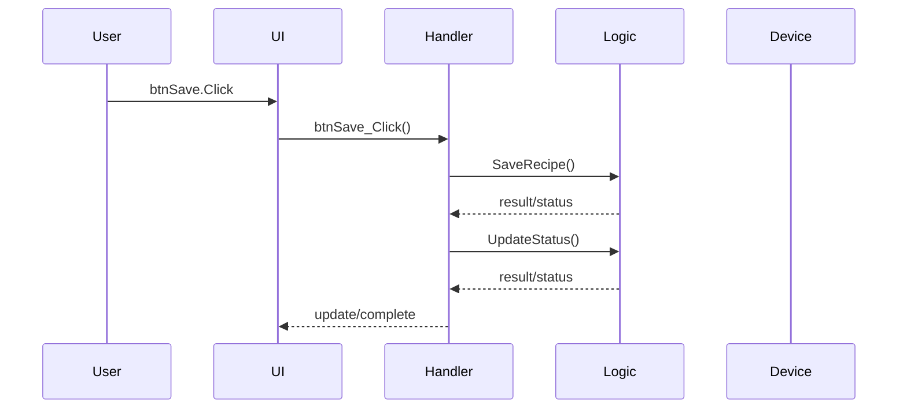
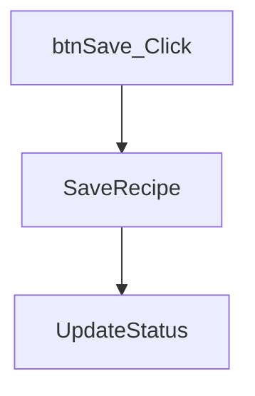

# Event Flow: btnSave.Click -> btnSave_Click

## Event Entry

| Item | Value |
|---|---|
| Entry | btnSave.Click |
| Handler | btnSave_Click |
| Source | Forms/MainForm.vb |
| Line | 17 |
| Confidence | 0.75 |

## Simplified Sequence Diagram

## Call Chain

## Handler Method Details

| Method | Calls | Side Effects | Source |
|---|---|---|---|
| btnSave_Click | ['SaveRecipe', 'UpdateStatus'] | ['Persistence or write operation candidate 推測'] | Forms/MainForm.vb |

## Method Purpose Analysis

### btnSave_Click

**用途：**
處理 GUI 或系統事件；執行 Stop 類型流程。推測

**推測依據：**
- 由事件或事件流程觸發: btnSave.Click, btnSave.Click
- 方法名稱包含事件處理常見關鍵字
- 名稱或呼叫鏈包含 Stop 相關關鍵字: end
- 呼叫方法: SaveRecipe, UpdateStatus

**副作用：**
- 可能存取 DB 或資料儲存: update
- 可能更新 UI 狀態或顯示內容: ui, form, update
- Persistence or write operation candidate 推測

**維護注意事項：**
- 檢查資料庫連線、交易、例外處理與設定來源
- 若此方法可能在背景執行，需檢查 UI thread Invoke / Dispatcher

## Review Notes

- 確認事件是否可能被重複觸發。
- 確認 handler 是否包含長時間阻塞操作。
- 確認設備或資料存取是否有例外處理。
