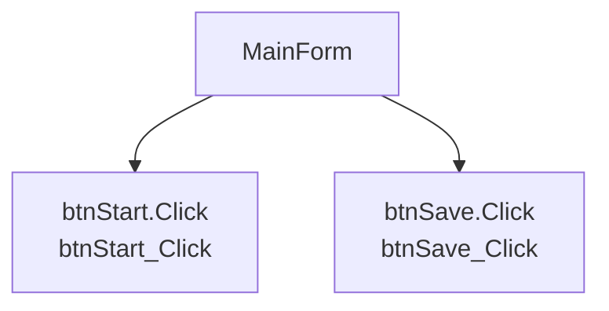

# Form: MainForm

## Responsibility Summary

- 畫面用途：根據事件與方法推測，此 Form 可能負責使用者操作入口、狀態顯示或特定功能流程。推測
- 需人工確認：畫面實際責任、導航來源、是否包含設備控制或資料存取。

## UI Event Entries

| Control | Event | Handler | Source | Line |
|---|---|---|---|---|
| btnStart | Click | btnStart_Click | Forms/MainForm.vb | 16 |
| btnSave | Click | btnSave_Click | Forms/MainForm.vb | 17 |

## Form Event Flow Graph

## Handler Methods

| Method | Calls | Side Effects | Source |
|---|---|---|---|
| btnStart_Click | ['StartInspection', 'UpdateStatus'] | ['Persistence or write operation candidate 推測'] | Forms/MainForm.vb |
| btnSave_Click | ['SaveRecipe', 'UpdateStatus'] | ['Persistence or write operation candidate 推測'] | Forms/MainForm.vb |

## Maintenance Notes

- 檢查此 Form 是否過度集中業務邏輯。
- 檢查事件 handler 是否直接操作設備、DB 或設定檔。
- 檢查長時間操作是否會阻塞 UI thread。

## Risks

| Risk | Evidence | Confidence |
|---|---|---|
| cross-thread UI risk | invoke | 0.55 |
| cross-thread UI risk | begininvoke | 0.55 |
| event leak risk | addhandler | 0.55 |
| blocking UI risk | thread.sleep | 0.55 |
