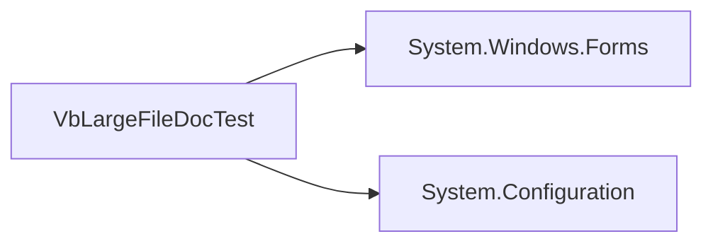

# Project: VbLargeFileDocTest

## Summary

Project-level chunk for module responsibility and dependencies.

## Project Metadata

| Item | Value |
|---|---|
| Name | VbLargeFileDocTest |
| Language | VB.NET |
| Path | VbLargeFileDocTest.vbproj |
| Target Framework | net48 |
| GUI Project | True |
| Responsibility Inference | [] |

## Local Dependency Graph

## Dependencies

| Type | Target | Source |
|---|---|---|
| Reference | System.Windows.Forms | VbLargeFileDocTest.vbproj |
| Reference | System.Configuration | VbLargeFileDocTest.vbproj |

## Module Responsibility

- 主要責任：需人工確認。推測
- 維護注意：確認此模組是否同時承擔 UI、業務邏輯、設備控制或資料存取，避免耦合過高。

## Risks

| Risk | Evidence | Confidence |
|---|---|---|
