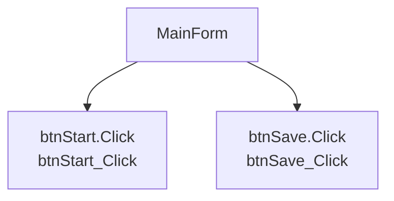

# MainForm.vb Industrial Manual

## Base Form Chunk

本文件以 `docs/chunks/forms/MainForm.md` 為基礎，並在後續章節補充 source-backed 方法手冊、事件入口與維護資訊。

# Form: MainForm

## Responsibility Summary

- 畫面用途：根據事件與方法推測，此 Form 可能負責使用者操作入口、狀態顯示或特定功能流程。推測
- 需人工確認：畫面實際責任、導航來源、是否包含設備控制或資料存取。

## UI Event Entries

| Control | Event | Handler | Source | Line |
|---|---|---|---|---|
| btnStart | Click | btnStart_Click | Forms/MainForm.vb | 16 |
| btnSave | Click | btnSave_Click | Forms/MainForm.vb | 17 |

## Form Event Flow Graph

## Handler Methods

| Method | Calls | Side Effects | Source |
|---|---|---|---|
| btnSave_Click | ['SaveRecipe', 'UpdateStatus'] | ['Persistence or write operation candidate 推測'] | Forms/MainForm.vb |
| btnStart_Click | ['StartInspection', 'UpdateStatus'] | ['Persistence or write operation candidate 推測'] | Forms/MainForm.vb |

## Maintenance Notes

- 檢查此 Form 是否過度集中業務邏輯。
- 檢查事件 handler 是否直接操作設備、DB 或設定檔。
- 檢查長時間操作是否會阻塞 UI thread。

## Risks

| Risk | Evidence | Confidence |
|---|---|---|
| cross-thread UI risk | invoke | 0.55 |
| cross-thread UI risk | begininvoke | 0.55 |
| event leak risk | addhandler | 0.55 |
| blocking UI risk | thread.sleep | 0.55 |

## 1. Document Overview

`Forms/MainForm.vb` 已產生 source-backed 單檔手冊。已確認的說明會附上來源行號；不確定的行為會保留在 Open Questions。

## 2. 核心流程

| Entry | Handler | Call Chain | Summary | Evidence | Status |
|---|---|---|---|---|---|
| btnStart.Click | btnStart_Click | btnStart_Click -> StartInspection -> UpdateStatus | 執行檢測流程，包含連線、取像、結果評估與狀態更新。 | Forms/MainForm.vb:16 | confirmed |
| btnSave.Click | btnSave_Click | btnSave_Click -> SaveRecipe -> UpdateStatus | 儲存配方或設定資料，並更新畫面狀態。 | Forms/MainForm.vb:17 | confirmed |

## 3. Handler Methods

| Control | Event | Handler Method | Detailed Summary | Line |
|---|---|---|---|---|
| btnStart | Click | [btnStart_Click](#method-btnstart_click) | 執行檢測流程，包含連線、取像、結果評估與狀態更新。 | 16 |
| btnSave | Click | [btnSave_Click](#method-btnsave_click) | 儲存配方或設定資料，並更新畫面狀態。 | 17 |

## 4. UI 事件入口

| Control | Event | Handler | Line | Status |
|---|---|---|---|---|
| btnStart | Click | btnStart_Click | 16 | confirmed |
| btnSave | Click | btnSave_Click | 17 | confirmed |

## 5. 狀態機與 Region

| Kind | Name / Expression | Line Range | Status |
|---|---|---|---|
| Region | inspection branch filler 0 | 833-846 | confirmed |
| Region | inspection branch filler 1 | 883-892 | confirmed |
| Region | inspection branch filler 2 | 894-901 | confirmed |
| Region | PLC and Camera Simulation | 1993-2002 | confirmed |
| Switch/Case | mode | 38-916 | confirmed |

## 6. 已確認副作用

| Method | Effect | Evidence | Line Range | Status |
|---|---|---|---|---|
| StartInspection | config access | ConfigurationManager | 29-35 | confirmed |
| StartInspection | device/camera/plc call | Plc, Camera, Capture | 29-35 | confirmed |
| ConnectPlc | blocking wait | Thread.Sleep | 1994-1997 | confirmed |
| ConnectPlc | device/camera/plc call | Plc | 1994-1997 | confirmed |
| CaptureCameraImage | blocking wait | Thread.Sleep | 1998-2001 | confirmed |
| CaptureCameraImage | device/camera/plc call | Camera, Capture | 1998-2001 | confirmed |
| SaveRecipe | config access | ConfigurationManager | 2003-2007 | confirmed |
| SaveRecipe | file access | File. | 2003-2007 | confirmed |
| UpdateStatus | ui thread update | BeginInvoke, InvokeRequired | 2008-2015 | confirmed |

## 7. Method Details

### New

**方法說明**:

已定位方法內容；實際業務語意仍需人工確認。

**方法邏輯**:

靜態分析未偵測到內部呼叫或主要副作用。

**參數說明**:

| Item | 型態 | 數值範圍 | 說明 |
|---|---|---|---|
| **輸入參數** | N/A | N/A | N/A |
| 無 | N/A | N/A | 此方法未宣告輸入參數。 |
| **輸出參數** | N/A | N/A | 未偵測到輸出參數或新物件建立。 |

**注意事項**:

- 來源：`Forms/MainForm.vb:12-18`
- 狀態：`confirmed`

---

### btnStart_Click

**方法說明**:

執行檢測流程，包含連線、取像、結果評估與狀態更新。

**方法邏輯**:

Calls: StartInspection -> UpdateStatus

**參數說明**:

| Item | 型態 | 數值範圍 | 說明 |
|---|---|---|---|
| **輸入參數** | N/A | N/A | N/A |
| sender | Object | See caller / validation logic | sender As Object |
| e | EventArgs | See caller / validation logic | e As EventArgs |
| **輸出參數** | N/A | N/A | 未偵測到輸出參數或新物件建立。 |

**注意事項**:

- 來源：`Forms/MainForm.vb:19-23`
- 狀態：`confirmed`
- 已確認呼叫方法：`StartInspection`, `UpdateStatus`

---

### btnSave_Click

**方法說明**:

儲存配方或設定資料，並更新畫面狀態。

**方法邏輯**:

Calls: SaveRecipe -> UpdateStatus

**參數說明**:

| Item | 型態 | 數值範圍 | 說明 |
|---|---|---|---|
| **輸入參數** | N/A | N/A | N/A |
| sender | Object | See caller / validation logic | sender As Object |
| e | EventArgs | See caller / validation logic | e As EventArgs |
| **輸出參數** | N/A | N/A | 未偵測到輸出參數或新物件建立。 |

**注意事項**:

- 來源：`Forms/MainForm.vb:24-28`
- 狀態：`confirmed`
- 已確認呼叫方法：`SaveRecipe`, `UpdateStatus`

---

### StartInspection

**方法說明**:

執行檢測流程，包含連線、取像、結果評估與狀態更新。

**方法邏輯**:

Calls: CaptureCameraImage -> ConnectPlc -> EvaluateResult 已確認副作用：config access, device/camera/plc call

**參數說明**:

| Item | 型態 | 數值範圍 | 說明 |
|---|---|---|---|
| **輸入參數** | N/A | N/A | N/A |
| 無 | N/A | N/A | 此方法未宣告輸入參數。 |
| **輸出參數** | N/A | N/A | 未偵測到輸出參數或新物件建立。 |

**注意事項**:

- 來源：`Forms/MainForm.vb:29-35`
- 狀態：`confirmed`
- 已確認呼叫方法：`CaptureCameraImage`, `ConnectPlc`, `EvaluateResult`
- 已確認副作用：`config access`, `device/camera/plc call`

---

### EvaluateResult

**方法說明**:

執行檢測流程，包含連線、取像、結果評估與狀態更新。

**方法邏輯**:

Contains branch/state-machine style logic.

**參數說明**:

| Item | 型態 | 數值範圍 | 說明 |
|---|---|---|---|
| **輸入參數** | N/A | N/A | N/A |
| mode | Integer | See caller / validation logic | mode As Integer |
| **輸出參數** | N/A | N/A | 未偵測到輸出參數或新物件建立。 |

**注意事項**:

- 來源：`Forms/MainForm.vb:36-1991`
- 狀態：`confirmed`

---

### ConnectPlc

**方法說明**:

已定位方法內容；實際業務語意仍需人工確認。

**方法邏輯**:

已確認副作用：blocking wait, device/camera/plc call

**參數說明**:

| Item | 型態 | 數值範圍 | 說明 |
|---|---|---|---|
| **輸入參數** | N/A | N/A | N/A |
| ip | String | See caller / validation logic | ip As String |
| **輸出參數** | N/A | N/A | 未偵測到輸出參數或新物件建立。 |

**注意事項**:

- 來源：`Forms/MainForm.vb:1994-1997`
- 狀態：`confirmed`
- 已確認副作用：`blocking wait`, `device/camera/plc call`

---

### CaptureCameraImage

**方法說明**:

執行檢測流程，包含連線、取像、結果評估與狀態更新。

**方法邏輯**:

已確認副作用：blocking wait, device/camera/plc call

**參數說明**:

| Item | 型態 | 數值範圍 | 說明 |
|---|---|---|---|
| **輸入參數** | N/A | N/A | N/A |
| 無 | N/A | N/A | 此方法未宣告輸入參數。 |
| **輸出參數** | N/A | N/A | 未偵測到輸出參數或新物件建立。 |

**注意事項**:

- 來源：`Forms/MainForm.vb:1998-2001`
- 狀態：`confirmed`
- 已確認副作用：`blocking wait`, `device/camera/plc call`

---

### SaveRecipe

**方法說明**:

儲存配方或設定資料，並更新畫面狀態。

**方法邏輯**:

已確認副作用：config access, file access

**參數說明**:

| Item | 型態 | 數值範圍 | 說明 |
|---|---|---|---|
| **輸入參數** | N/A | N/A | N/A |
| 無 | N/A | N/A | 此方法未宣告輸入參數。 |
| **輸出參數** | N/A | N/A | 未偵測到輸出參數或新物件建立。 |

**注意事項**:

- 來源：`Forms/MainForm.vb:2003-2007`
- 狀態：`confirmed`
- 已確認副作用：`config access`, `file access`

---

### UpdateStatus

**方法說明**:

透過 UI 執行緒更新畫面狀態。

**方法邏輯**:

已確認副作用：ui thread update Contains conditional logic.

**參數說明**:

| Item | 型態 | 數值範圍 | 說明 |
|---|---|---|---|
| **輸入參數** | N/A | N/A | N/A |
| message | String | See caller / validation logic | message As String |
| **輸出參數** | N/A | N/A | 可能會建立新物件。 |

**注意事項**:

- 來源：`Forms/MainForm.vb:2008-2015`
- 狀態：`confirmed`
- 已確認副作用：`ui thread update`

---

## 8. Open Questions

- Confirm operator-facing names and expected pass/fail behavior with equipment owners.
- Confirm external device, PLC, and camera semantics when source uses simulator or placeholder methods.
