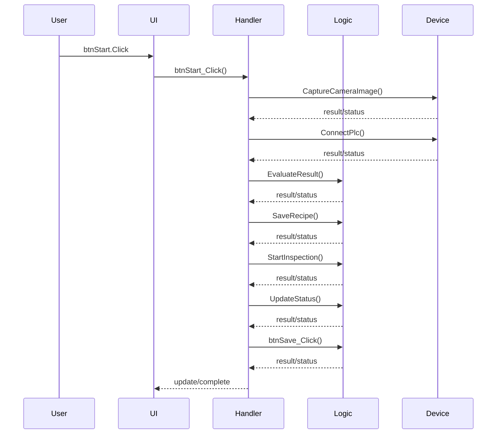

# Event Flow Specification

## Requirements

### Requirement: btnStart.Click shall invoke btnStart_Click

The system SHALL route `btnStart.Click` to handler `btnStart_Click`.

#### Scenario: btnStart.Click shall invoke btnStart_Click

- GIVEN the GUI event `btnStart.Click` occurs
- THEN handler `btnStart_Click` SHALL execute
- AND the candidate call chain SHALL be reviewed: `['btnStart_Click', 'CaptureCameraImage', 'ConnectPlc', 'EvaluateResult', 'SaveRecipe', 'StartInspection', 'UpdateStatus', 'btnSave_Click']`

**Source:** `Forms/MainForm.vb`


**Chunk Summary:**

# Event Flow: btnStart.Click -> btnStart_Click

## Event Entry

| Item | Value |
|---|---|
| Entry | btnStart.Click |
| Handler | btnStart_Click |
| Source | Forms/MainForm.vb |
| Line | 16 |
| Confidence | 0.75 |

## Simplified Sequence Diagram



## Call Chain

```mermaid
flowchart TD
 ...

### Requirement: btnSave.Click shall invoke btnSave_Click

The system SHALL route `btnSave.Click` to handler `btnSave_Click`.

#### Scenario: btnSave.Click shall invoke btnSave_Click

- GIVEN the GUI event `btnSave.Click` occurs
- THEN handler `btnSave_Click` SHALL execute
- AND the candidate call chain SHALL be reviewed: `['btnSave_Click', 'CaptureCameraImage', 'ConnectPlc', 'EvaluateResult', 'SaveRecipe', 'StartInspection', 'UpdateStatus']`

**Source:** `Forms/MainForm.vb`


**Chunk Summary:**

# Event Flow: btnSave.Click -> btnSave_Click

## Event Entry

| Item | Value |
|---|---|
| Entry | btnSave.Click |
| Handler | btnSave_Click |
| Source | Forms/MainForm.vb |
| Line | 17 |
| Confidence | 0.75 |

## Simplified Sequence Diagram

```mermaid
sequenceDiagram
  participant User
  participant UI
  participant Handler
  participant Logic
  participant Device
  User->>UI: btnSave.Click
  UI->>Handler: btnSave_Click()
  Handler->>Device: CaptureCameraImage()
  Device-->>Handler: result/status
  Handler->>Device: ConnectPlc()
  Device-->>Handler: result/status
  Handler->>Logic: EvaluateResult()
  Logic-->>Handler: result/status
  Handler->>Logic: SaveRecipe()
  Logic-->>Handler: result/status
  Handler->>Logic: StartInspection()
  Logic-->>Handler: result/status
  Handler->>Logic: UpdateStatus()
  Logic-->>Handler: result/status
  Handler-->>UI: update/complete
```

## Call Chain

```mermaid
flowchart TD
  N0["btnSave_Click"]
  N0 --> N1["CaptureCameraImage"]
  N1 --> N2["Connect...


## Safety Notes

- Timer, async, BackgroundWorker, and device-control event flows MUST be reviewed for re-entry, blocking calls, timeout handling, and UI thread safety.
