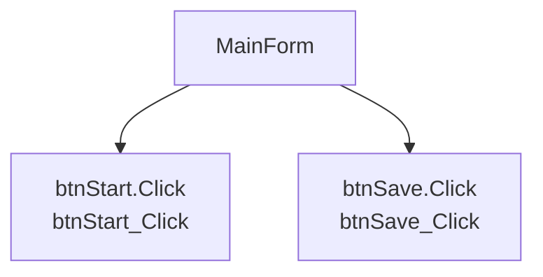

# UI Forms Specification

## Requirements

### Requirement: Form MainForm shall be documented

The system SHALL document `MainForm` as a GUI surface with detected events and handler methods.

#### Scenario: Form MainForm shall be documented

- GIVEN the user interacts with `MainForm`
- THEN event entries and handler methods SHALL be reviewed before UI behavior changes.

**Source:** `Forms/MainForm.vb`

**Chunk Summary:**

# Form: MainForm

## Responsibility Summary

- 畫面用途：根據事件與方法推測，此 Form 可能負責使用者操作入口、狀態顯示或特定功能流程。推測
- 需人工確認：畫面實際責任、導航來源、是否包含設備控制或資料存取。

## UI Event Entries

| Control | Event | Handler | Source | Line |
|---|---|---|---|---|
| btnStart | Click | btnStart_Click | Forms/MainForm.vb | 16 |
| btnSave | Click | btnSave_Click | Forms/MainForm.vb | 17 |

## Form Event Flow Graph

## Handler Methods

| Method | Calls | Side Effects | Source |
|---|---|---|---|
| btnSave_Click | ['CaptureCameraImage', 'ConnectPlc', 'EvaluateResult', 'SaveRecipe', 'StartInspection', 'UpdateStatus'] | ['Persistence or write operation candidate 推測', 'External device/API interaction candidate 推測'] | Forms/MainForm.vb |
| btnStart_Click | ['CaptureCameraImage', 'ConnectPlc', 'EvaluateResult', 'SaveRecipe', 'StartInspection', 'UpdateStatus', 'btnSave_Click'] | ['Per...

## Assumptions

- Form responsibility summaries may be inferred from filenames, controls, and event handlers.
