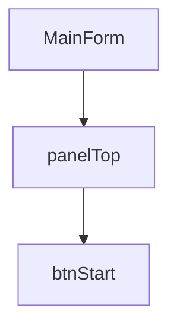

    ---
    name: winforms-ui-analyzer
    description: Analyze WinForms UI hierarchy and control/event relationships.
    version: 0.1.0
    ---


# winforms-ui-analyzer

## Purpose

Analyze WinForms UI structure from Designer files.

## Supported Controls

- Form
- Panel
- GroupBox
- TabControl
- Button
- TextBox
- PictureBox
- DataGridView
- UserControl
- CustomControl

## Input

- *.Designer.cs
- *.Designer.vb
- *.resx

## Output

```text
exports/normalized/
  forms.json
  controls.json

docs/
  03_forms_ui_structure.md

openspec/specs/ui-forms/spec.md
```

## Rules

- Parse InitializeComponent().
- Preserve event binding.
- Preserve parent-child hierarchy.
- Preserve Dock/Anchor/Layout.
- Detect custom controls.
- Generate Mermaid diagrams when possible.

## Mermaid Example



