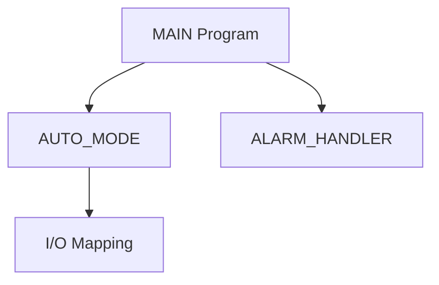

# Mitsubishi PLC Documentation Kit

## Purpose

This skill helps convert Mitsubishi PLC project exports into Git-friendly normalized data and Markdown documentation.

Primary goals:

1. Guide the user to export useful text files from GX Works2 / GX Works3.
2. Normalize exported CSV / TXT / XML / ST / mnemonic files into JSON.
3. Generate documentation for PLC project structure, labels, devices, parameters, modules, networks, alarms, and cross references.
4. Avoid fabricating PLC details that are not present in the exported files.

## Important boundary

Do **not** assume direct parsing support for proprietary Mitsubishi project files such as `.gx3`, `.gxw`, `.gppw`, `.gd2`, or other closed binary/project containers.

The supported workflow is:

```text
GX Works2 / GX Works3 project
  -> export text / CSV / XML / ST / mnemonic / reports
  -> normalize exports
  -> generate Markdown documents
  -> commit raw + normalized + docs to Git
```

If the user only provides a proprietary project file, ask them to export text-based artifacts first. If they cannot, produce an export checklist and mark direct parsing as unsupported.

## Trigger phrases

Use this skill when the user asks about:

- Mitsubishi PLC documentation
- GX Works2 or GX Works3 export
- PLC project version control
- PLC project structure document
- PLC parameter explanation
- label / device comment / cross reference analysis
- ladder mnemonic parsing
- ST program analysis
- PLC Markdown document generation
- PLC Git diff workflow

## Expected input folder layout

Prefer this structure:

```text
exports/raw/
  project_info/
  labels/
  device_comments/
  programs/
  parameters/
  module_config/
  network/
  reports/
```

Common file examples:

```text
exports/raw/labels/global_labels.csv
exports/raw/labels/local_labels.csv
exports/raw/device_comments/device_comments.csv
exports/raw/programs/main.st
exports/raw/programs/alarm_ladder_mnemonic.csv
exports/raw/parameters/cpu_parameter.csv
exports/raw/parameters/module_parameter.csv
exports/raw/network/network_parameter.csv
exports/raw/reports/cross_reference.csv
exports/raw/reports/compile_result.txt
```

## Output folder layout

Generate or recommend this output:

```text
exports/normalized/
  project.json
  programs.json
  labels.json
  devices.json
  parameters.json
  modules.json
  networks.json
  cross_reference.json
  diagnostics.json

docs/
  README.md
  00_project_overview.md
  01_system_configuration.md
  02_cpu_parameters.md
  03_module_parameters.md
  04_network_parameters.md
  05_program_structure.md
  06_labels.md
  07_device_comments.md
  08_alarm_list.md
  09_cross_reference.md
  10_change_log.md
  diagrams/
```

## Operating modes

### 1. Export advisor mode

Use when the user has not exported files yet.

Produce:

- Export checklist
- Folder layout
- Git strategy
- Which files are required vs optional
- Manual confirmation list

Recommended priority:

| Priority | Export item | Purpose |
|---|---|---|
| P0 | Global Label CSV | Variable table |
| P0 | Local Label CSV | Program-level variable table |
| P0 | Device Comment CSV | Device documentation |
| P0 | ST or mnemonic program export | Program structure |
| P1 | CPU parameter export | CPU setting documentation |
| P1 | Module parameter export | Module/I/O setting documentation |
| P1 | Cross reference report | Usage analysis |
| P2 | Network parameter export | Communication setting documentation |
| P2 | Compile/build report | Diagnostics and quality checks |

### 2. Normalizer mode

Use when exported files exist.

Normalize data into JSON using these principles:

- Preserve all original columns.
- Map known fields to standard names when possible.
- Put unknown fields under `raw`.
- Record parse errors in `diagnostics.json`.
- Never discard unknown vendor-specific fields.
- Keep file path and source row number for traceability.

Suggested standard fields:

```json
{
  "name": "",
  "address": "",
  "data_type": "",
  "scope": "",
  "program": "",
  "comment": "",
  "source_file": "",
  "source_row": 0,
  "raw": {}
}
```

### 3. Documentation generator mode

Use when normalized JSON or raw exports are available.

Generate GitHub-style Markdown documentation.

Rules:

- Do not invent missing project details.
- Use `N/A` for absent values.
- Mark inferred content as `推測`.
- Prefer device comments and labels over LLM guesses.
- Include source file names when possible.
- For each parameter, document original value, interpreted meaning, system impact, risk, and check point.

### 4. Structure analyzer mode

Analyze:

- Program tree
- POU / FB / Function relationship
- Label usage
- Device read/write usage
- Cross reference
- I/O mapping
- Alarm/interlock relationship

For diagrams, generate Mermaid when useful:



Rules:

- If cross reference is incomplete, produce a partial graph only.
- Do not guess call relationships absent from the source.
- For ST files, parse obvious function calls and FB instances.
- For mnemonic ladder export, parse device read/write patterns conservatively.

### 5. Parameter explainer mode

For each CPU/module/network parameter, output:

```markdown
| Parameter | Original Value | Meaning | System Impact | Risk | Check Point |
|---|---:|---|---|---|---|
```

Rules:

- Preserve original Mitsubishi parameter name.
- Preserve original value.
- If the exact official meaning is not known from the provided data, write `需查手冊`.
- Do not apply generic PLC assumptions to a specific module without evidence.

## Recommended command behavior for Gemini CLI

When running through Gemini CLI, use this skill as an instruction file. The model should:

1. Read this `SKILL.md` first.
2. Inspect `references/` for schema and documentation templates.
3. Inspect `examples/` for expected output style.
4. Use `scripts/` only when deterministic parsing or file generation is needed.
5. Produce files instead of only chat answers when the user asks for a documentation kit.

Example prompt:

```bash
gemini -p "Read skills/mitsubishi-plc-doc-kit/SKILL.md and generate documentation from exports/raw into docs/ and exports/normalized. Follow the skill rules strictly."
```

## Quality checklist

Before finalizing output, verify:

- Raw exported files are preserved.
- Normalized JSON includes source traceability.
- Missing values are marked as `N/A`.
- Guesses are marked as `推測`.
- Parameter explanations include risk and check points.
- Mermaid diagrams are based only on available relationships.
- Git diff output is stable and deterministic where possible.

## Refusal / caution cases

Do not proceed as if complete analysis is possible when:

- Only a proprietary Mitsubishi project file is provided.
- The exported files do not include labels, comments, programs, or parameters.
- The user asks to reverse engineer protected or inaccessible project files.

Instead, provide a safe export checklist and explain what is missing.
