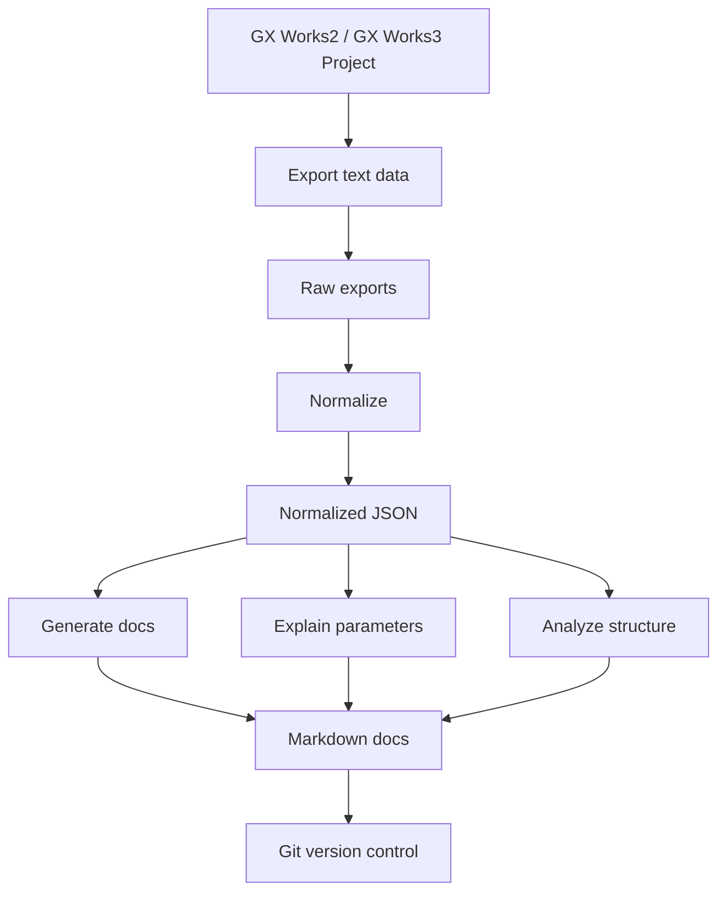

# Mitsubishi PLC Documentation Kit

This project provides a set of skills and tools for generating documentation from Mitsubishi PLC projects exported from GX Works2/GX Works3. It focuses on parsing exported text files (CSV, XML, ST, mnemonic, etc.) rather than directly parsing proprietary project files.

## Overview

The kit consists of several skills that work together to:

1. Advise on exporting data from GX Works
2. Normalize exported data into structured JSON
3. Generate Markdown documentation
4. Explain parameters in detail
5. Analyze project structure and dependencies

## Workflow



## Skills

- `mitsubishi-plc-export-advisor`: Advises on what to export from GX Works
- `mitsubishi-plc-project-normalizer`: Converts exported files to normalized JSON
- `mitsubishi-plc-doc-generator`: Generates Markdown documentation
- `mitsubishi-plc-parameter-explainer`: Explains CPU/module/network parameters
- `mitsubishi-plc-structure-analyzer`: Analyzes program structure and dependencies

## Project Structure

```
mitsubishi-plc-docs/
  README.md
  exports/
    raw/          # Exported files from GX Works
    normalized/   # Normalized JSON data
  docs/           # Generated documentation
  skills/         # Skill definitions
  tools/          # Python scripts for processing
  examples/       # Sample data and docs
```

## Getting Started

1. Export data from your GX Works project (see skills/mitsubishi-plc-export-advisor.md)
2. Place exports in exports/raw/
3. Run normalization tools
4. Generate documentation

## Limitations

This kit does not directly parse .gx3, .gxw, or other proprietary Mitsubishi project files. It works with exported text/CSV/XML/ST files only.