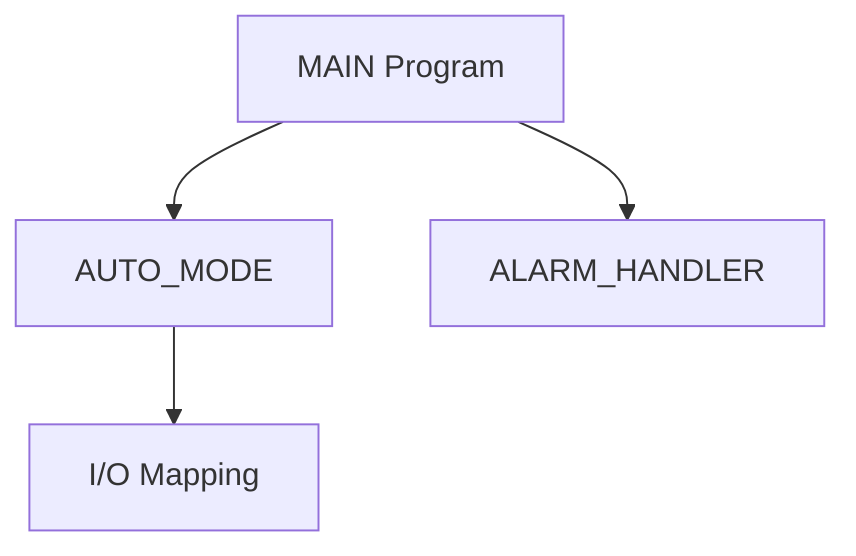

# Skill: mitsubishi-plc-structure-analyzer

## Purpose
分析 Mitsubishi PLC 專案的程式結構、Label 使用關係、Device 使用關係與 Cross Reference，產生架構文件與 Mermaid 圖。

## Input
- programs.json
- labels.json
- devices.json
- cross_reference.json

## Output
- docs/05_program_structure.md
- docs/09_cross_reference.md
- docs/diagrams/*.md

## Mermaid output example

## Rules

* 若 cross reference 不完整，只能產生 partial graph。
* 不要猜測未出現在資料中的呼叫關係。
* 對於 ST 可嘗試解析 function / FB call。
* 對於 ladder mnemonic 可嘗試解析 device read/write。