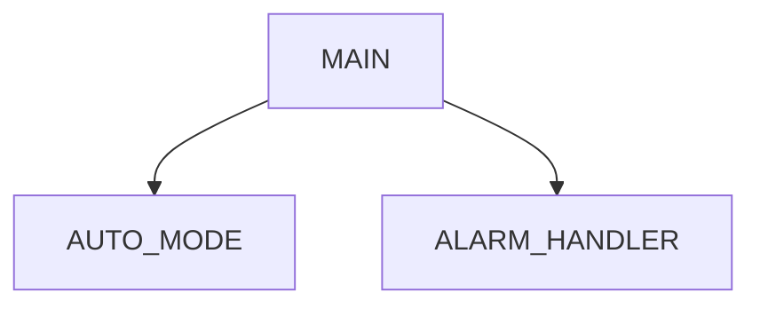

# Mitsubishi PLC Structure Analyzer

## Purpose

Analyze project structure from normalized PLC data and produce program maps, dependency summaries, device usage tables, and Mermaid diagrams.

## Input

Prefer:

```text
exports/normalized/programs.json
exports/normalized/labels.json
exports/normalized/devices.json
exports/normalized/cross_reference.json
```

Fallback:

```text
exports/raw/programs/
exports/raw/cross_reference/
```

## Output

Write or update:

```text
docs/05_program_structure.md
docs/09_cross_reference.md
docs/diagrams/program_structure.md
```

## Analysis tasks

1. List programs, POU, FB, and functions if available.
2. Summarize source language: Ladder mnemonic, ST, FBD, SFC, unknown.
3. Extract visible calls from ST or text when possible.
4. Extract device usage from source and cross reference.
5. Classify device usage as read/write only when source data proves it.
6. Identify alarm candidates from device comments containing `alarm`, `error`, `異常`, `警報`, `故障`.
7. Identify interlock candidates from comments containing `interlock`, `lock`, `禁止`, `互鎖`, `條件`.

## Mermaid rules

Only draw confirmed relationships. If relationships are incomplete, label the diagram as `partial`.

Example:



## Do not

- Do not guess call relationships that are not present.
- Do not claim a device is written unless cross reference or source proves write usage.
- Do not infer safety logic without evidence.
