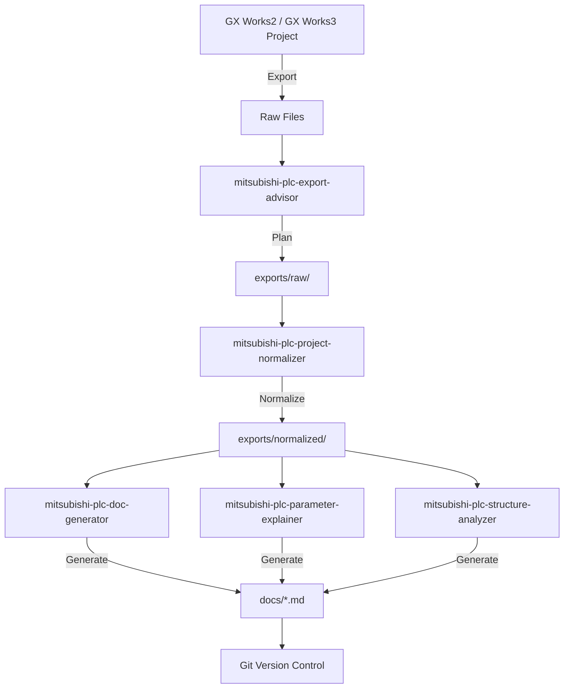

# Mitsubishi PLC Skills Pack

Official Mitsubishi PLC documentation generation toolkit following Claude Code / Agent Skills standards.

這是一組符合 Claude Code / Agent Skills 目錄慣例的 Mitsubishi PLC 文件化 Skills Pack，整合了 mitsubishi-plc-docs 的完整功能。

## 官方相容目錄結構

每個 Skill 都是獨立資料夾，並且每個資料夾內都有自己的 `SKILL.md`：

```text
mitsubishi-plc-skills-official/
├── .claude/
│   └── skills/
│       ├── mitsubishi-plc-export-advisor/
│       │   ├── SKILL.md                    # 匯出規劃
│       │   ├── references/
│       │   ├── scripts/
│       │   └── assets/
│       ├── mitsubishi-plc-project-normalizer/
│       │   ├── SKILL.md                    # 資料標準化
│       │   ├── references/
│       │   ├── scripts/normalize_exports.py
│       │   └── assets/
│       ├── mitsubishi-plc-doc-generator/
│       │   ├── SKILL.md                    # 文檔產生
│       │   ├── references/
│       │   ├── scripts/generate_docs.py
│       │   └── assets/
│       ├── mitsubishi-plc-parameter-explainer/
│       │   ├── SKILL.md                    # 參數說明
│       │   ├── references/
│       │   ├── scripts/
│       │   └── assets/
│       └── mitsubishi-plc-structure-analyzer/
│           ├── SKILL.md                    # 結構分析
│           ├── references/
│           ├── scripts/
│           │   ├── parse_st.py            # ST 程式解析
│           │   └── parse_mnemonic.py      # 助記碼解析
│           └── assets/
├── exports/
│   ├── raw/                               # GX Works 匯出的原始檔案
│   └── normalized/                        # 標準化的 JSON 資料
├── docs/                                  # 產生的 Markdown 文檔
├── examples/
│   └── sample_exports/                    # 範例資料
└── README.md
```

## 建議工作流程 (Recommended Workflow)



### 步驟 1: 匯出規劃 (Export Planning)

使用 `mitsubishi-plc-export-advisor` 決定應該從 GX Works 匯出什麼資料。

**輸出**: `exports/raw/` 目錄結構建議

### 步驟 2: 資料標準化 (Normalization)

執行 `mitsubishi-plc-project-normalizer` 將 CSV / TXT / ST / mnemonic 轉換為統一的 JSON 結構。

```bash
python .claude/skills/mitsubishi-plc-project-normalizer/scripts/normalize_exports.py exports/raw exports/normalized
```

**輸出**: `exports/normalized/*.json`

### 步驟 3: 文檔與分析 (Documentation & Analysis)

並行執行三個技能：

**3a. 文檔產生**
```bash
python .claude/skills/mitsubishi-plc-doc-generator/scripts/generate_docs.py exports/normalized docs
```

**3b. ST 程式解析**
```bash
python .claude/skills/mitsubishi-plc-structure-analyzer/scripts/parse_st.py exports/raw/programs exports/normalized
```

**3c. 助記碼分析**
```bash
python .claude/skills/mitsubishi-plc-structure-analyzer/scripts/parse_mnemonic.py exports/raw/programs exports/normalized
```

**輸出**: `docs/*.md`, `exports/normalized/st_programs.json`, `exports/normalized/mnemonics.json`

### 步驟 4: 版本控制 (Version Control)

```bash
git add exports/normalized/ docs/ 
git commit -m "Update PLC documentation from GX Works export"
```

1. `/mitsubishi-plc-export-advisor`：規劃 GX Works2 / GX Works3 應匯出的文本資料。
2. `/mitsubishi-plc-project-normalizer`：將 `exports/raw/` 內的 CSV / TXT / ST / mnemonic 轉成 `exports/normalized/*.json`。
3. `/mitsubishi-plc-doc-generator`：根據 normalized JSON 產生 `docs/*.md`。
4. `/mitsubishi-plc-parameter-explainer`：產生 CPU / Module / Network 參數說明。
5. `/mitsubishi-plc-structure-analyzer`：產生程式結構、Device/Label 使用關係與 Mermaid 圖。

## Claude Code 安裝

### 專案層級

將 Skills 複製到你的 GX Works documentation project 內：

```bash
cp -r .claude/skills/* /path/to/your-project/.claude/skills/
cp -r examples/sample_exports /path/to/your-project/
mkdir -p /path/to/your-project/exports/{raw,normalized}
```

### 個人層級

安裝到 Claude 的全局 Skills 目錄：

```bash
mkdir -p ~/.claude/skills
cp -r .claude/skills/* ~/.claude/skills/
```

### VS Code 中使用

1. 在 VS Code 中打開專案資料夾
2. 打開 Copilot Chat (Ctrl+Shift+I)
3. 提及 @Skill 或使用 `/` 觸發 Skill 選單
4. 選擇相應的 Mitsubishi PLC skill

## Python 環境準備

Skills 中的 Python 工具需要以下依賴：

```bash
pip install -r requirements.txt
```

基本依賴：
- `pathlib` (標準庫)
- `json` (標準庫)
- `csv` (標準庫)
- `re` (標準庫)

## 快速開始 (Quick Start)

### 1. 從 GX Works 匯出資料

從 GX Works2 / GX Works3 中執行以下匯出：
- Global Labels → CSV
- Device Comments → CSV
- Programs → ST or Mnemonic CSV
- CPU Parameters → CSV or Report
- Module Parameters → CSV or Report
- Cross Reference → CSV (if available)

將匯出的檔案放入 `exports/raw/` 的相應子資料夾。

### 2. 執行標準化

```bash
python .claude/skills/mitsubishi-plc-project-normalizer/scripts/normalize_exports.py exports/raw exports/normalized
```

### 3. 產生文檔

```bash
python .claude/skills/mitsubishi-plc-doc-generator/scripts/generate_docs.py exports/normalized docs
```

### 4. 在 Copilot 中分析結果

打開 `docs/README.md` 並在 Copilot Chat 中提問：
- "Summarize the CPU parameters from the normalized data"
- "Identify which devices are used most frequently"
- "What alarms and interlocks are defined in this project?"

## Gemini CLI 使用方式

Gemini CLI 不一定會自動掃描 Claude Skills，因此建議明確要求它讀取某個 `SKILL.md`：

```bash
gemini -p "Read .claude/skills/mitsubishi-plc-export-advisor/SKILL.md and plan GX Works export files for a Mitsubishi PLC documentation workflow."
```

```bash
gemini -p "Read .claude/skills/mitsubishi-plc-project-normalizer/SKILL.md. Normalize files under exports/raw into exports/normalized. Do not invent missing values."
```

或使用 GitHub Copilot CLI：

```bash
copilot --prompt "@Skill mitsubishi-plc-export-advisor: Plan export for our iQ-R PLC project"
```

## 輸出範例 (Output Examples)

### 產生的文檔結構

```
docs/
├── README.md                      # 文檔索引
├── 00_project_overview.md         # 專案概覽
├── 01_system_configuration.md     # 系統組態
├── 02_cpu_parameters.md           # CPU 參數詳解
├── 03_module_parameters.md        # 模組參數詳解
├── 04_network_parameters.md       # 網路參數詳解
├── 05_program_structure.md        # 程式結構圖
├── 06_labels.md                   # 變數列表
├── 07_device_comments.md          # Device 說明
├── 08_alarm_list.md               # 警報列表
├── 09_cross_reference.md          # 交叉參考
└── 10_diagnostics.md              # 診斷與遺漏項目
```

### 標準化 JSON 結構

```json
{
  "project": {
    "name": "Sample PLC Project",
    "plc_series": "iQ-R",
    "cpu_model": "R04CPU",
    "software": "GX Works3",
    "exported_at": "2024-01-15"
  },
  "programs": [],
  "labels": [],
  "devices": [],
  "parameters": [],
  "modules": [],
  "networks": [],
  "diagnostics": []
}
```

## 重要限制 (Important Limitations)

### ❌ 本套件不支援

- 直接解析 `.gx3`、`.gxw`、`.gppw` proprietary project files
- 直接解析 GX Works 的二進位檔案格式
- 自動從 GX Works 複製檔案（需人工匯出）

### ✅ 本套件支援

- 解析 GX Works 匯出的 **CSV / TXT / XML / ST / mnemonic** 文字檔
- 標準化不同格式的匯出資料
- 產生版本控制友善的 JSON 中間格式
- 根據標準化資料產生 Markdown 文檔
- 分析程式結構和 Device 使用關係

## 工作流程總結 (Workflow Summary)

```text
GX Works Project
    ↓
    └─→ [Export as CSV/TXT/XML/ST/Mnemonic]
        ↓
        └─→ exports/raw/
            ↓
            └─→ mitsubishi-plc-project-normalizer
                ↓
                └─→ exports/normalized/ (JSON)
                    ↓
                    ├─→ mitsubishi-plc-doc-generator
                    │   ↓
                    │   └─→ docs/*.md
                    ├─→ mitsubishi-plc-parameter-explainer
                    │   ↓
                    │   └─→ docs/02_cpu_parameters.md etc.
                    └─→ mitsubishi-plc-structure-analyzer
                        ↓
                        └─→ docs/05_program_structure.md etc.

                        ↓
                        └─→ Git Commit
```

## 整合源 (Integration Notes)

此專案整合了以下來源的功能和內容：
- **mitsubishi-plc-docs**: 完整的工具和範例
- **mitsubishi-plc-skills-official**: 官方 Claude Code Skills 結構

所有整合工作旨在提供一個單一的、標準化的、可維護的 PLC documentation toolkit。

## 貢獻與擴展 (Contributions & Extensions)

未來計畫的增強功能：
- [ ] Git diff 報告產生
- [ ] PLC 變更影響分析
- [ ] Label 命名規則檢查
- [ ] Device 重複使用檢查
- [ ] Alarm/Interlock 自動整理
- [ ] WebSocket/OPC-UA 參數推送驗證
- [ ] 網路拓撲圖產生

## 重要限制

此套件不假設可以直接解析 `.gx3`、`.gxw`、`.gppw` 等 proprietary project file。建議先由 GX Works 匯出 CSV / TXT / XML / ST / mnemonic / report，再由 Skills 解析。
