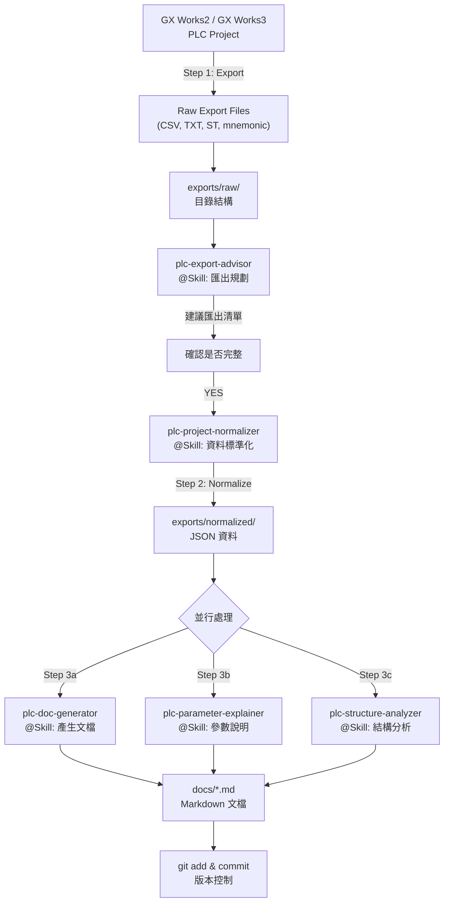

# PLC Skills Kit - PLC 文件化工具

**PLC Documentation Generation Skills Repository | SKILL 倉庫**

一個完整的 Claude Code / GitHub Copilot Agent Skills 倉庫，用於自動化生成  GX Works PLC 專案的技術文檔。

**用途**: 將 GX Works2 / GX Works3 匯出的 CSV、ST、mnemonic 等文本檔轉換為版本控制友善的標準化 JSON 資料，並自動產生 GitHub Markdown 文檔。

## 🎯 專案定位

- **類型**:  PLC 文檔化 Skills 倉庫
- **適配**: Claude Code、GitHub Copilot、Gemini CLI
- **運行環境**: Python 3.7+
- **核心功能**: 匯出規劃 → 資料標準化 → 文檔產生 → 結構分析

## 📁 Skills 倉庫結構

每個 Skill 都是獨立資料夾，包含自己的 `SKILL.md` 定義：

```text
plc-skills-kit/
├── .claude/
│   └── skills/                                 # Claude Agent Skills 目錄
│       ├── plc-export-advisor/
│       │   ├── SKILL.md                        # Skill 定義 (v0.3.0)
│       │   ├── references/                     # 參考文檔
│       │   ├── scripts/                        # 腳本
│       │   └── assets/                         # 資源
│       ├── plc-project-normalizer/
│       │   ├── SKILL.md                        # Skill 定義
│       │   ├── references/
│       │   ├── scripts/normalize_exports.py    # 核心工具
│       │   └── assets/
│       ├── plc-doc-generator/
│       │   ├── SKILL.md                        # Skill 定義
│       │   ├── references/
│       │   ├── scripts/generate_docs.py        # 核心工具
│       │   └── assets/
│       ├── plc-parameter-explainer/
│       │   ├── SKILL.md                        # Skill 定義
│       │   ├── references/
│       │   ├── scripts/
│       │   └── assets/
│       └── plc-structure-analyzer/
│           ├── SKILL.md                        # Skill 定義
│           ├── references/
│           ├── scripts/
│           │   ├── parse_st.py                # ST 程式解析工具
│           │   └── parse_mnemonic.py          # 助記碼解析工具
│           └── assets/
├── exports/                                    # 專案資料目錄
│   ├── raw/                                    # GX Works 匯出的原始檔案
│   │   ├── labels/
│   │   ├── device_comments/
│   │   ├── programs/
│   │   ├── parameters/
│   │   ├── module_config/
│   │   ├── network/
│   │   ├── cross_reference/
│   │   └── reports/
│   └── normalized/                            # 標準化的 JSON 資料
│       ├── project.json
│       ├── labels.json
│       ├── devices.json
│       ├── parameters.json
│       ├── modules.json
│       ├── networks.json
│       └── diagnostics.json
├── docs/                                       # 產生的 Markdown 技術文檔
│   ├── README.md
│   ├── 00_project_overview.md
│   ├── 01_system_configuration.md
│   ├── 02_cpu_parameters.md
│   ├── 03_module_parameters.md
│   ├── 04_network_parameters.md
│   ├── 05_program_structure.md
│   ├── 06_labels.md
│   ├── 07_device_comments.md
│   ├── 08_alarm_list.md
│   ├── 09_cross_reference.md
│   └── 10_diagnostics.md
├── examples/
│   └── sample_exports/                         # 範例匯出資料
│       ├── project.json
│       └── global_labels.csv
├── README.md                                   # 此檔案
├── requirements.txt                            # Python 依賴
└── LICENSE                                     # 開源許可證


## 🔄 推薦工作流程 (Recommended Workflow)



## 📖 Skills 使用指南

### Step 1️⃣ : 匯出規劃 (Export Planning)

**使用 Skill**: `plc-export-advisor`

決定應該從 GX Works 匯出什麼資料。此 Skill 會生成詳細的匯出清單，包含優先級和用途說明。

**在 Copilot Chat 中使用**:
```
@Skill plc-export-advisor

我有一個 iQ-R PLC 專案，包含 ST 程式。請規劃匯出流程。
```

**輸出**: `exports/raw/` 目錄結構建議與匯出清單

### Step 2️⃣ : 資料標準化 (Data Normalization)

**使用 Skill**: `plc-project-normalizer`

將匯出的 CSV / TXT / ST / mnemonic 檔案轉換為統一的 JSON 結構。

**執行命令**:
```bash
python .claude/skills/plc-project-normalizer/scripts/normalize_exports.py exports/raw exports/normalized
```

**或在 Copilot Chat 中**:
```
@Skill plc-project-normalizer

我已將匯出檔案放在 exports/raw。請進行標準化。
```

**輸出**: 
- `exports/normalized/project.json`
- `exports/normalized/labels.json`
- `exports/normalized/devices.json`
- `exports/normalized/parameters.json`
- 等等...

### Step 3️⃣ : 並行處理 - 文檔與分析 (Documentation & Analysis)

三個 Skills 可以並行運行，處理標準化後的 JSON 資料：

#### 3a. 文檔產生

**使用 Skill**: `plc-doc-generator`

```bash
python .claude/skills/plc-doc-generator/scripts/generate_docs.py exports/normalized docs
```

**或**:
```
@Skill plc-doc-generator

根據 exports/normalized 的資料產生完整的技術文檔。
```

**輸出**: `docs/00_project_overview.md` 到 `docs/10_diagnostics.md`

#### 3b. 參數說明

**使用 Skill**: `plc-parameter-explainer`

```
@Skill plc-parameter-explainer

為專案中的 CPU 參數、模組參數和網路參數生成詳細說明。
```

**輸出**: `docs/02_cpu_parameters.md`, `docs/03_module_parameters.md` 等

#### 3c. 結構分析

**使用 Skill**: `plc-structure-analyzer`

```bash
python .claude/skills/plc-structure-analyzer/scripts/parse_st.py exports/raw/programs exports/normalized
python .claude/skills/plc-structure-analyzer/scripts/parse_mnemonic.py exports/raw/programs exports/normalized
```

**或**:
```
@Skill plc-structure-analyzer

分析程式結構、Label 使用關係、Device 使用關係，並生成 Mermaid 圖。
```

**輸出**: `docs/05_program_structure.md`, `docs/09_cross_reference.md`, Mermaid 圖

### Step 4️⃣ : 版本控制 (Version Control)

```bash
git add exports/normalized/ docs/ 
git commit -m "PLC doc: Update from GX Works export $(date +%Y-%m-%d)"
git push
```

## 🔧 Skills 安裝指南

### 1. 到 Claude Code 安裝

**專案層級** - 整個專案使用這些 Skills:

```bash
# 從 PLC Skills Kit 複製到你的 PLC 文檔專案
cp -r .claude/skills/* /path/to/your-plc-project/.claude/skills/
cp -r examples/sample_exports /path/to/your-plc-project/
mkdir -p /path/to/your-plc-project/exports/{raw,normalized}
```

**個人層級** - 所有專案都可用:

```bash
mkdir -p ~/.claude/skills
cp -r .claude/skills/* ~/.claude/skills/
```

### 2. VS Code / GitHub Copilot 使用

1. **打開專案**: 在 VS Code 中打開 PLC 文檔專案
2. **打開 Chat**: 按 `Ctrl+Shift+I` 打開 Copilot Chat
3. **觸發 Skills**: 輸入 `@Skill` 或按 `/` 鍵
4. **選擇 Skill**: 從列表選擇相應的 PLC Skill

### 3. Gemini CLI 使用

```bash
# 查看某個 Skill 的詳細定義
gemini -p "Read .claude/skills/plc-export-advisor/SKILL.md and plan GX Works export files."

# 執行特定任務
gemini -p "Read .claude/skills/plc-project-normalizer/SKILL.md. Normalize CSV files in exports/raw."
```

### 4. GitHub Copilot CLI

```bash
copilot --prompt "@Skill plc-export-advisor: Plan for iQ-R PLC with ST programs"
```

## 🐍 Python 環境設置

Skills 中的工具需要 Python 3.7+ 和標準庫依賴。

### 快速安裝

```bash
pip install -r requirements.txt
```

### 依賴清單

基本依賴 (都包含在 Python 標準庫):
- `pathlib` - 路徑操作
- `json` - JSON 解析和序列化
- `csv` - CSV 文件讀寫
- `re` - 正則表達式

可選依賴 (用於高級功能):
- `pyyaml` - YAML 支援
- `jinja2` - 模板引擎
- `pandas` - 大型 CSV 處理

## 🚀 快速開始 (Quick Start)

### 場景: 我有一個現成的 GX Works3 iQ-R PLC 專案

#### 第 1 步: 從 GX Works 匯出

打開 GX Works3，執行以下匯出操作：
- **Global Labels** → 匯出為 CSV → `exports/raw/labels/global_labels.csv`
- **Device Comments** → 匯出為 CSV → `exports/raw/device_comments/device_comments.csv`
- **Program Source** → 匯出為 ST 或 mnemonic CSV → `exports/raw/programs/`
- **CPU Parameters** → 匯出為 CSV → `exports/raw/parameters/cpu_parameter.csv`
- **Module Parameters** → 匯出為 CSV → `exports/raw/parameters/module_parameter.csv`
- **Cross Reference** (可選) → 匯出為 CSV → `exports/raw/cross_reference/`

#### 第 2 步: 標準化資料

在專案根目錄運行:
```bash
python .claude/skills/plc-project-normalizer/scripts/normalize_exports.py exports/raw exports/normalized
```

#### 第 3 步: 產生文檔

```bash
python .claude/skills/plc-doc-generator/scripts/generate_docs.py exports/normalized docs
```

#### 第 4 步: 在 Copilot 中審查

1. 打開 `docs/README.md`
2. 按 `Ctrl+Shift+I` 打開 Copilot Chat
3. 提問: "Summarize the key parameters in this PLC project"

#### 第 5 步: 提交到 Git

```bash
git add exports/normalized/ docs/
git commit -m "docs: Generate PLC documentation from GX Works export"
git push
```

## 📋 AI Chat 中的使用範例

### 在 Copilot Chat 中

```
@Skill plc-export-advisor

我有一個  iQ-R PLC 專案，包含：
- ST 程式（自動和手動模式）
- 多個通訊模組（CC-Link IE）
- 約 200+ 個 Global Label

請建議我應該匯出哪些檔案。
```

**期望輸出**: 詳細的匯出清單、優先級、每個匯出的用途

```
@Skill plc-parameter-explainer

我已標準化了參數。請解釋：
- CPU Watchdog Timer 設定的意義
- Module 參數如何影響通訊
- 網路參數的風險點
```

### 在 Gemini CLI 中

```bash
gemini -p "
Read .claude/skills/plc-structure-analyzer/SKILL.md.

Then analyze the program structure from:
- exports/normalized/programs.json
- exports/normalized/labels.json
- exports/raw/programs/

Identify:
1. All programs and functions
2. Device usage patterns
3. Potential interlocks
4. Cross-reference opportunities
"
```

## 📚 輸出示例

### 產生的文檔結構

```
docs/
├── README.md                           # 文檔主頁
├── 00_project_overview.md              # 專案基本信息
├── 01_system_configuration.md          # 系統組態
├── 02_cpu_parameters.md                # CPU 參數詳解
├── 03_module_parameters.md             # 模組參數詳解
├── 04_network_parameters.md            # 網路參數詳解
├── 05_program_structure.md             # 程式結構與依賴圖
├── 06_labels.md                        # 全域/局域變數表
├── 07_device_comments.md               # Device 說明與映射
├── 08_alarm_list.md                    # 警報與互鎖列表
├── 09_cross_reference.md               # 交叉參考分析
└── 10_diagnostics.md                   # 診斷與未解析項目
```

### 標準化 JSON 結構

```
docs/
├── README.md                      # 文檔索引
├── 00_project_overview.md         # 專案概覽
├── 01_system_configuration.md     # 系統組態
├── 02_cpu_parameters.md           # CPU 參數詳解
├── 03_module_parameters.md        # 模組參數詳解
├── 04_network_parameters.md       # 網路參數詳解
├── 05_program_structure.md        # 程式結構圖
├── 06_labels.md                   # 變數列表
├── 07_device_comments.md          # Device 說明
├── 08_alarm_list.md               # 警報列表
├── 09_cross_reference.md          # 交叉參考
└── 10_diagnostics.md              # 診斷與遺漏項目
```

## ⚠️ 限制與注意事項

### ❌ 本套件不支援

| 項目 | 說明 |
|------|------|
| 直接解析 `.gx3` | Proprietary binary GX Works project files |
| 直接解析 `.gxw` | GX Works2 project files |
| 直接解析 `.gppw` | 封裝的 GX Works 專案 |
| 二進位檔案 | GX Works 的內部二進位格式 |
| 即時同步 | 與執行中的 GX Works 實例通訊 |
| 自動匯出 | 無法自動從 GX Works 中複製檔案 |

### ✅ 本套件支援

| 功能 | 說明 |
|------|------|
| 解析匯出格式 | CSV, TXT, XML, ST (Structured Text), Mnemonic |
| 資料標準化 | 統一多個 GX Works 版本的輸出格式 |
| 文檔產生 | 自動產生 GitHub Markdown 文檔 |
| 版本控制 | 支援 Git diff 和版本追蹤 |
| 結構分析 | 程式依賴圖、Device 使用關係 |
| 參數說明 | CPU/模組/網路參數詳解 |
| 多語言支援 | UTF-8, CP932 (Shift-JIS), Big5 等編碼 |

## 🤝 貢獻與擴展

此 Skills 倉庫歡迎貢獻。計畫中的增強功能：

- [ ] Git Diff 智能報告
- [ ] PLC 變更影響分析
- [ ] Label 命名規則檢查和驗證
- [ ] Device 重複使用檢查
- [ ] Alarm/Interlock 自動整理和分類
- [ ] OPC-UA / WebSocket 參數推送驗證
- [ ] 網路拓撲圖自動產生
- [ ] Safety 相關參數識別
- [ ] 備份和恢復策略建議

## 📜 授權與致謝

此專案採用 MIT 或 Apache 2.0 授權。詳見 `LICENSE` 檔案。

### 核心元件版本

- plc-export-advisor v0.3.0
- plc-project-normalizer v0.3.0
- plc-doc-generator v0.3.0
- plc-parameter-explainer v0.3.0
- plc-structure-analyzer v0.3.0

### 參考資料

- [Mitsubishi Electric 官方文檔](https://www.mitsubishielectric.com/fa/)
- GX Works3 使用者手冊
- IEC 61131-3 標準

## 💬 常見問題 (FAQ)

### Q: 我可以用這個工具直接打開 .gx3 檔案嗎？
**A**: 不可以。本工具只支援 GX Works 匯出的 **CSV、XML、ST、mnemonic** 等文本格式。

### Q: 如何處理很大的 PLC 專案（數千個 Label）？
**A**: 本工具支援大型專案。CSV 解析器會自動處理編碼問題。Python 記憶體通常不是瓶頸。

### Q: 可以客製化產出的 Markdown 格式嗎？
**A**: 可以編輯 `scripts/generate_docs.py` 的模板部分。歡迎貢獻改進版本。

### Q: 支援哪些 Mitsubishi PLC 系列？
**A**: 理論上支援所有系列 (FX, Q, L, iQ-F, iQ-R)。限制在 GX Works 的匯出能力。

### Q: 如何整合到 CI/CD 流程中？
**A**: 可以編寫 GitHub Actions 工作流程，在每次 PLC 程式更新時自動產生文檔。

## 📦 倉庫組成

- **5 個 Agent Skills**: 完全獨立、可組合使用
- **Python 工具**: 無外部依賴 (標準庫 only)
- **完整文檔**: 中英文雙語
- **範例資料**: 快速開始用的示例檔案
- **MIT/Apache 2.0**: 開源授權

## 🔗 相關資源

- [Claude Code Documentation](https://code.claude.ai/)
- [GitHub Copilot Skills](https://github.com/features/copilot)
- [Mitsubishi GX Works3](https://www.mitsubishielectric.com/fa/)
- [IEC 61131-3 Standard](https://www.iec.ch/)

---

**最後更新**: 2024-05-13  
**版本**: 0.3.0  
**維護者**: PLC Skills Kit Contributors
